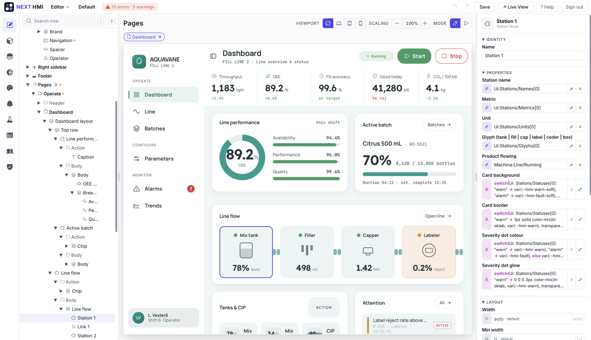
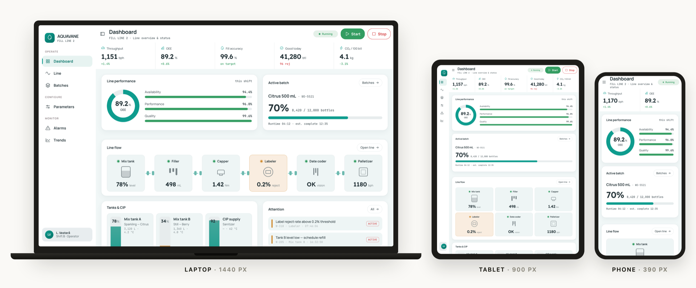
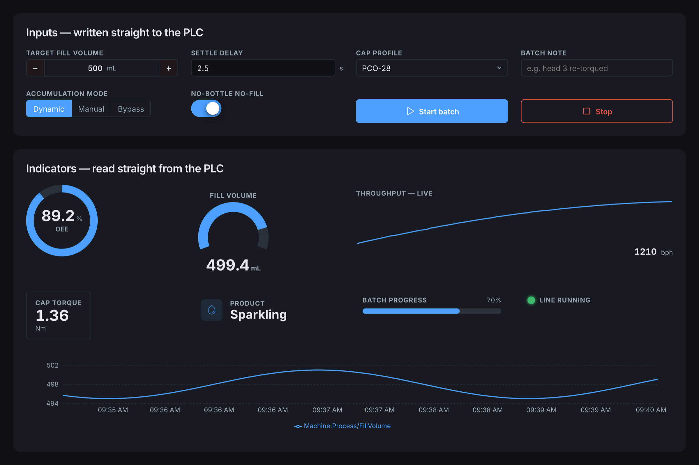
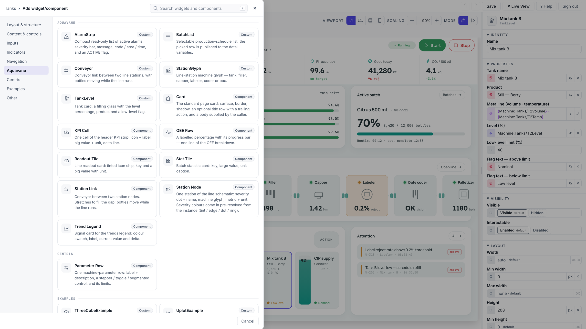
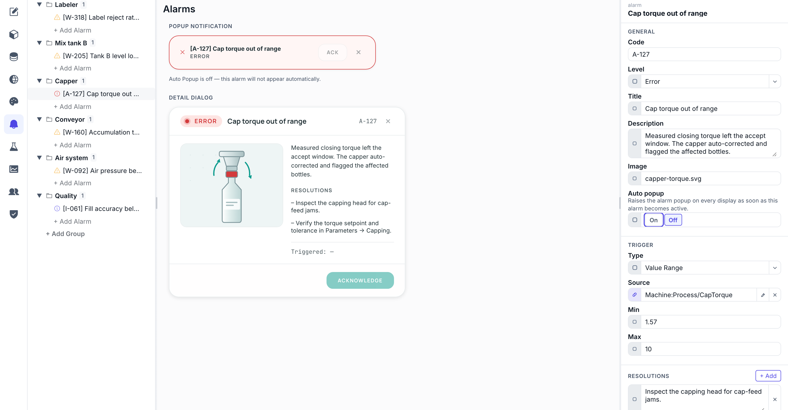
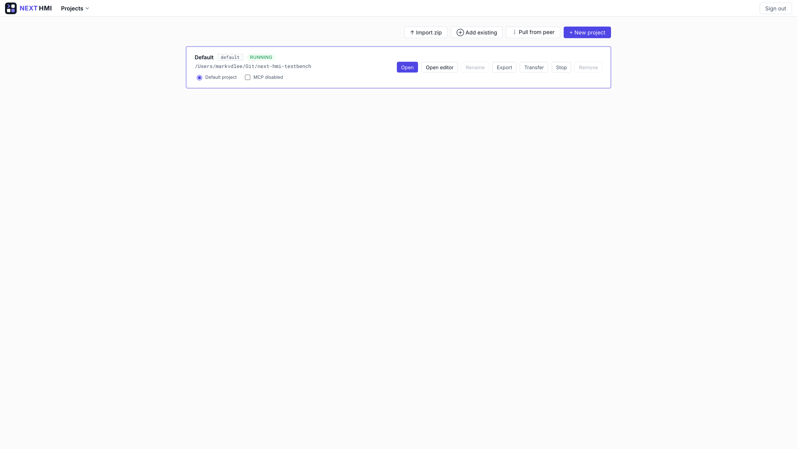
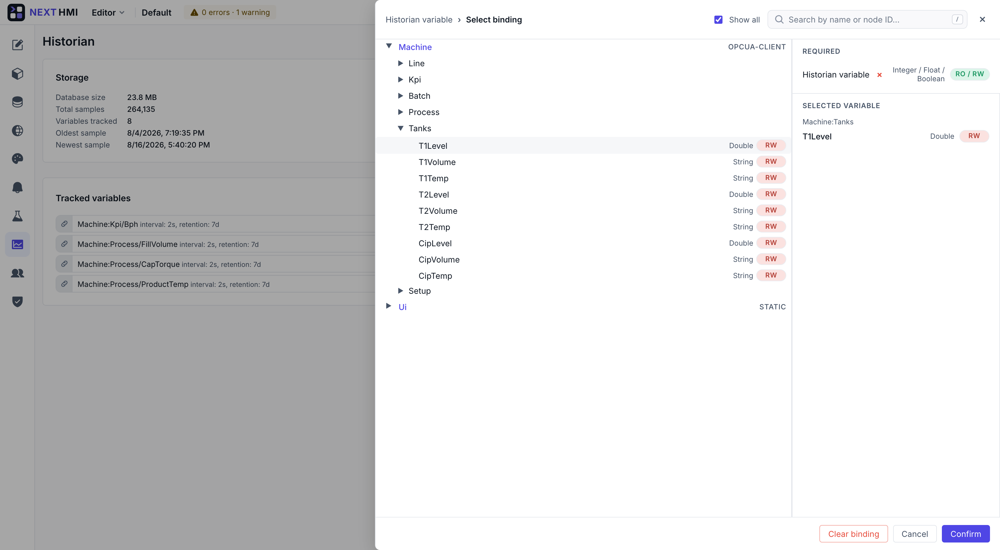

# NEXT HMI

> Your plant deserves better than a panel from 2009.

[](LICENSING.md)
[](https://github.com/mpnvdlee/next-hmi/pkgs/container/next-hmi)
[](https://github.com/mpnvdlee/next-hmi/releases)
[](https://next-hmi.com/docs/)

NEXT HMI replaces proprietary HMI/SCADA panels with one self-hosted server: your
PLCs on OPC-UA in, live operator screens in any browser out, and the whole
project as plain JSON and CSV your team can diff, review and version.

No seat licences. No tag counts. No feature paywall — historian, alarms with
acknowledgement, recipes, users and permissions are all in this build, and there
is no licence check in it at all.



---

## Get it running

Two ways in, same runtime, same project folder — so what you try on your laptop
is what runs on the line. Both boot with a seeded example project, so there is
something to click before you have a PLC connected.

### 1 · Docker — servers and anything with a container runtime

```bash
docker run -d --name nexthmi -p 8000:8000 -p 8443:8443 \
  -v nexthmi-data:/data ghcr.io/mpnvdlee/next-hmi:latest
```

Open **<http://localhost:8000>**. The image is multi-arch (`linux/amd64` +
`linux/arm64`); swap `:latest` for a version tag such as `:1.0.0` to pin a
release.

Both ports are published on purpose: turning on HTTPS in Settings moves the app
to `8443` and leaves `8000` redirecting there. Map them one-to-one.

With compose instead — `docker-compose.yml` at the repo root binds
`./project-data` to `/data`:

```bash
docker compose up -d
```

### 2 · Portable zip — panel PCs, Windows and Apple-silicon Macs

Download `nexthmi-windows-x64-<version>.zip` or
`nexthmi-macos-arm64-<version>.zip` from the
[Releases](https://github.com/mpnvdlee/next-hmi/releases) page, unzip anywhere
you can write, and double-click `nexthmi.exe` or `nexthmi.command`. No
installer, no admin rights, no Python or Node on the host. A terminal opens and
prints the URL to visit.

These builds are unsigned, so the OS asks once — Gatekeeper on macOS,
SmartScreen on Windows. The
[one-time steps](docs/user/install.md#first-run-gatekeeper-prompts) are two
lines each. The zip also carries the full guide as an offline HTML site in
`docs/` beside the executable.

There is no portable Linux build; on Linux, use Docker.

### First launch — two passwords, then you are in

1. Set the **device-admin password** on the manager dashboard. It gates the
   installation.
2. On the seeded project, choose **Set operator password** — that creates the
   project's own `admin` account for the HMI. Nothing ships with a default
   operator credential.
3. **Start** the project, then open its runtime or its editor.

Full install reference — runtime home, HTTPS, environment variables, upgrades:
[`docs/user/install.md`](docs/user/install.md).

---

## What it looks like

One project — a bottling line — from the screens an operator touches back to
the editor that builds them. Click any shot for full size.

<table>
<tr>
<td width="50%" valign="top">
<a href="docs/screenshots/responsive.png"></a>
<sub><b>One page, every screen</b> — laptop, panel PC, tablet and phone off the same layout. No second project for mobile.</sub>
</td>
<td width="50%" valign="top">
<a href="docs/screenshots/widgets-theme-dark.png"></a>
<sub><b>Themeable to the token</b> — every built-in widget reads its colour, radius and spacing from theme tokens. Swap the theme, not the pages.</sub>
</td>
</tr>
<tr>
<td width="50%" valign="top">
<a href="docs/screenshots/widget-catalog.png"></a>
<sub><b>Widget catalogue</b> — built-ins, your own custom widgets and reusable components, searchable in one picker.</sub>
</td>
<td width="50%" valign="top">
<a href="docs/screenshots/alarm-editor-detail.png"></a>
<sub><b>Alarm authoring</b> — the popup and detail dialog preview live beside the definition driving them.</sub>
</td>
</tr>
<tr>
<td width="50%" valign="top">
<a href="docs/screenshots/project-manager.png"></a>
<sub><b>Project manager</b> — many projects per server, each a folder you can export, transfer to another box or pull from a peer.</sub>
</td>
<td width="50%" valign="top">
<a href="docs/screenshots/variable-picker.png"></a>
<sub><b>Variable picker</b> — browse the live node tree, filtered to the types the field accepts, wherever a binding is asked for.</sub>
</td>
</tr>
</table>

The longer walkthrough — the editor, the property panel and its 23 sources, the
OPC-UA wizard, recipes, translations and theming — is at
**[next-hmi.com/tour](https://next-hmi.com/tour)**.

---

## What you get

- **In-browser editor** — pages, datasources, alarms, translations and users at
  `/editor/<project>/`, with a live preview. No engineering workstation, no
  dongle.
- **OPC-UA out of the box** — an `asyncua` client pool subscribes, writes and
  browses, viewport-aware so the tags on screen update first.
- **Git-native projects** — every artifact is JSON or CSV on disk, so your
  change control already works and a project moves as a folder or a zip.
- **Property sources** — 23 composable sources (`$var`, `$if`, `$switch`,
  `$loc`, `$viewport`, …) that nest, so no property needs a script.
- **Custom widgets** — drop a `.tsx` into `custom-widgets/` and it hot-compiles.
  No Node toolchain, no rebuild of the core.
- **AI-driven engineering** — a built-in MCP server exposing 30+ read/write
  tools, with dry-run diffs guarding every destructive change.
- **Responsive by project** — one project branches layout by viewport class, so
  the maintenance engineer's phone is not a second project to keep in step.

One binding language covers every property on every widget:

```jsonc
// colour the gauge from the live motor temperature
"color": {
  "$if": {
    "cond": { "$compare": [ { "$var": "PLC1:motor1.temp" }, ">", 120 ] },
    "then": "#e5484d",
    "else": "#2563eb"
  }
},
"label": { "$loc": "MotorSpeed" },
"value": { "$var": "PLC1:motor1.speed" }
```

Built on FastAPI · React · OPC-UA · `asyncua` · Python 3.14 · Node 22+.

---

## Build from source

Requirements: **Python 3.14** (>=3.14.2, <3.15) and **Node 22+**.

```bash
git clone https://github.com/mpnvdlee/next-hmi.git
cd next-hmi

python3 -m venv .venv && source .venv/bin/activate
pip install -r backend/requirements.txt
cd frontend && npm install && cd ..

python start-dev.py       # backend :8000, Vite with HMR :5173
```

Stop with `python start-dev.py --stop` or Ctrl-C. Tests and linters:
`pytest backend/tests`, `ruff check backend`, and `npm test` / `npm run lint` /
`npm run build` from `frontend/`.

## Documentation

- **[User guide](https://next-hmi.com/docs/)** ([`docs/user/`](docs/user/INDEX.md))
  — building dashboards, connecting OPC-UA, alarms, theming. Also shipped behind
  the editor's Help button.
- **[Contributor reference](docs/dev/INDEX.md)** ([`docs/dev/`](docs/dev/INDEX.md))
  — architecture, REST and WebSocket protocols, the custom-widget SDK, theming
  tokens, and the MCP server.

## Contributing

Fork, branch, keep the diff focused and tested, then `git commit -s` — the
sign-off is how you accept the CLA, and it is the only step. Open a pull request
describing the *why*. Details in [CONTRIBUTING.md](.github/CONTRIBUTING.md);
participation is governed by the
[Code of Conduct](.github/CODE_OF_CONDUCT.md). Bugs and ideas belong in a
[GitHub issue](https://github.com/mpnvdlee/next-hmi/issues).

## Security

NEXT HMI writes to PLCs and is meant to run on a trusted OT network behind a
VPN, never exposed to the public Internet — read
[Network placement and threat model](docs/dev/operations/deploy.md#network-placement-and-threat-model)
before putting it on any network. Report vulnerabilities privately via
[SECURITY.md](.github/SECURITY.md); never open a public issue for one.

## Licence

`AGPL-3.0-or-later` across the whole repository — no dual-licensed core, no
per-file carve-outs, no licence check in the build. Run it at any scale,
commercially, for as many operators and tags as the plant has.

The project content you author — pages, themes, translations, datasources,
custom widgets — is your own work and is not covered by the copyleft; that is
written down in [LICENSE-EXCEPTION.md](LICENSE-EXCEPTION.md) rather than left to
interpretation. Hand a build to someone outside your organisation and the AGPL
asks you to offer them the corresponding source; a
[commercial licence](COMMERCIAL.md) at €100 per shipped unit is the alternative
to doing that. A separate proprietary enterprise build adds an audit trail for
regulated plants — see [next-hmi.com/licensing](https://next-hmi.com/licensing).
