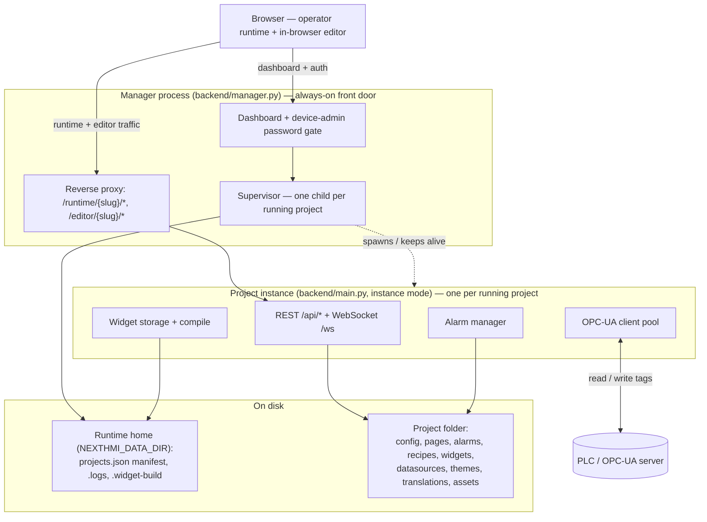

# NEXT HMI Architecture

This file is the top-level architecture hub for the current codebase.

## System Map

The browser reaches the always-on **manager** for the dashboard and device-admin
gate; runtime and editor traffic is reverse-proxied to a per-project **child
instance** the supervisor keeps alive. Each instance serves its own REST + `/ws`
APIs, connects out to PLCs through the OPC-UA client pool, and reads/writes its
project folder on disk. The sections below expand each piece.

## System Overview

NEXT HMI is split into three primary areas:

- `backend/`
  - FastAPI application
  - datasource lifecycle and OPC-UA integration
  - alarm engine and widget storage
  - REST and WebSocket APIs
- `frontend/`
  - React + TypeScript + Vite application
  - explicit `hmi`, `config`, and `shared` domains
  - unified property expressions across config editor and runtime
- **Runtime home** — resolved as `NEXTHMI_DATA_DIR` → bootstrap config file → `<repo>/.dev-runtime-home/` (source checkouts only) → `~/Documents/NextHMI/`. Full precedence in the [user guide](../../user/install.md#runtime-home).
  - `projects.json` — manifest of every project known to this runtime, plus the `running` set (which projects the supervisor keeps up)
  - sibling state files: `.manager-auth.json` (device-admin password digest), `.mcp-tokens.json`, `.peer-tokens.json`, `.peer-trust.json`, `tls/`
  - `.logs/`, `.widget-build/`
- **Projects** — self-contained folders anywhere on disk, each holding project data, translations, datasources, alarms, widgets, assets, and custom components. `project-seed/` in this repository is the clean template used to bootstrap the first project, by binary/Docker builds, and by the projects API. During development a separate private project, `project-testbench/` (real content plus intentional diagnostics and scale fixtures), can be cloned into the repo root; when present it is bootstrapped as the first project instead.
- **Manager + instances** — the always-on **manager** process (`backend/manager.py`) is the front door: it serves the dashboard, gates everything behind a device-admin password, supervises one **child instance** per *running* project, and reverse-proxies `/runtime/<slug>/*` and `/editor/<slug>/*` to the matching child. Each child is the ordinary single-project app (`backend/main.py`) run in instance mode, pinned to one project. There is no single "live" project anymore — the operator runs a *set* of projects concurrently. See [backend.md](backend.md) for the supervisor/proxy details.
- **Editions** — this repository builds one edition, `oss`: no feature gate, no license check, no `/api/admin` route group. A separate `ee` build exists in a private repository. It mounts additional routers on top of the same core app, and registers callbacks with the two generic seams core exposes for it (`core/audit.py`, `core/start_guards.py`) — the second is how an `ee` build holds project startup behind licence activation. Nothing is registered with either here, so both are no-ops in this build. See [backend.md](backend.md#edition-seam).

## High-Level Data Flow

The flow below describes a **single project instance** (`backend/main.py`). Each running project gets its own instance; the manager front door routes a browser to one of them by URL prefix (`/runtime/<slug>/` or `/editor/<slug>/`). `<live-project>` in this and the focused docs means "the project that instance is pinned to" — not a system-wide single live project.

1. project configuration is stored directly under `<live-project>/` (in dev, whichever project the runtime home bootstrapped — see the startup banner)
2. the frontend loads config and translations through `/api/config/*`
3. datasource metadata and variable trees are managed through `/api/datasources/*`
4. live values flow over `/ws`
5. alarm definitions are managed through `/api/alarms/*`; the backend evaluates triggers against live values and broadcasts state via WebSocket
6. user-defined widgets are managed through `/api/components/*`; the frontend registers each as a virtual component type (`$component:<id>`)
7. custom components are compiled into `<runtime_home>/.widget-build/<Name>/index.js` and loaded over `/widget-js/*`; per-component CSS and fonts are served from `/widgets/<Name>/`
8. property values can be static or expression-wrapped and are evaluated in runtime context
9. a project has multiple named themes managed through `/api/themes/*` (with a default-theme pointer); the active theme is applied as CSS custom properties at runtime

## Property Expression System

Property values support a unified `$`-keyed property-source contract for dynamic behavior
(`$static`, `$var`, `$loc`, `$if`, `$switch`, `$compare`, `$user`, `$time`,
`$widgetProp`, `$componentProp`, `$stringExpr`, `$alarmCount`, `$page`,
`$viewport`, `$result`, …). The complete model — every source, its shape and
produced type, the `$var` tree, OPC-UA type collapse, and resolution/coercion
rules — is the single source of truth in [value-types.md](value-types.md).
Runtime evaluation lives in `frontend/src/hmi/utils/propertySourceEval.ts`.

## Alarms And Widgets

- **Alarms** — `backend/services/alarm_manager.py` listens to datasource value changes, evaluates `value_range` and `bool` triggers, and maintains active alarms + history. Configuration lives in `<live-project>/alarms.json`; runtime state in `alarm_state.json`. Updates are pushed to clients as `alarm_snapshot` and `alarm_update` WebSocket messages.
- **Reusable components** — user-defined component groups with their own input properties. Each definition is stored as `<live-project>/components/<id>.json` and registered at startup as a virtual component type `$component:<id>` in the HMI registry. Trees inside reusable components cannot use `$var`; they use `$widgetProp` instead.

## Global Events

The project pages document's `globalEvents` field is a singleton config of
action lists fired on lifecycle events: `onHmiLoaded`, `onPageLoaded`,
`onLocaleChanged`, `onUserLoggedIn`, and `onUserLoggedOut`. It is represented by
the shared `PagesConfig` type and wired in
`frontend/src/hmi/hooks/useGlobalEvents.ts`.

## How To Use This Documentation

- Start here for the system map and cross-domain flow.
- Use backend architecture for runtime/service lifecycle details.
- Use frontend architecture for React domain/store/routing details.
- Use data architecture for live-project files and persisted payload shapes.
- Use API/custom-widgets docs when implementing endpoints or extensibility.

## Focused Documents

- [backend.md](backend.md)
- [frontend.md](frontend.md)
- [data-formats.md](data-formats.md)
- [value-types.md](value-types.md)
- [websocket.md](websocket.md)
- [../reference/rest-api.md](../reference/rest-api.md)
- [../reference/custom-widgets.md](../reference/custom-widgets.md)
- [../reference/theming.md](../reference/theming.md)
- [../reference/peer-transfer.md](../reference/peer-transfer.md)
- [../reference/mcp.md](../reference/mcp.md)

## Source Of Truth Rule

If this hub ever disagrees with a focused document, treat the focused document as the detailed source and verify against code.
