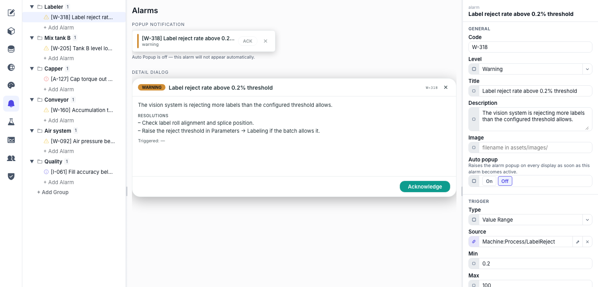

# Alarms & recipes

Two features that turn a dashboard into an operations tool: condition-based **alarms** with acknowledgement, and **recipes** — named parameter sets you push to and pull from live variables.

## Define an alarm

1. **Open the Alarms area** — Add an alarm (organise them in groups if you like).
2. **Point it at a variable** — Bind the alarm's **Source** to the tag it watches.
3. **Choose a trigger type** — **Boolean** — fires on `true` or `false`. **Value Range** — fires outside a **Min** / **Max** threshold.
4. **Set severity & presentation** — Pick **Error**, **Warning** or **Info**, give it a **Code** (`W-318`), a **Title** and a **Description**, and optionally an **Image** (a filename in `assets/images/`).

Three more fields turn a definition into something an operator can act on:

- **Auto popup** — **On** raises the alarm popup on every display the moment the alarm goes active. Leave it **Off** and it only shows up in the lists.
- **Resolutions** — an ordered list of what to check or do, shown in the alarm's detail dialog. This is where the tribal knowledge goes, instead of in a folder nobody opens.
- **Acknowledgment permissions → Allowed groups** — who may acknowledge it. Empty means anyone; set it and only those groups can clear the alarm. See [Users, groups & permissions](users.md).

The centre of the editor previews both surfaces live — the popup notification and the detail dialog — so you can see what the operator will read while you write it.

Surface them with the **Alarm List** and **Alarm History** widgets, and show a live count anywhere with the `$alarmCount` source (filter by `all` / `unacked` / `error` / `warning` / `info`). Both widgets carry an **Own frame** toggle — turn it off when the widget sits in a card that already draws one, and clear the **Title** to drop its header band too.

An alarm's source tag is subscribed whether or not any page shows it, so alarms keep evaluating on screens that never display them.

## Build a recipe

1. **Create a dataset type** — In the **Recipes** area, add a dataset **type** — the shape of one recipe (e.g. "Product profile").
2. **Add parameters** — For each value in the recipe, click **+ Add** and give it a **label** and a **binding** to the variable it maps to; the data type follows from the tag.
3. **Save datasets** — Store named datasets under the type — one per product, grade or batch.

The two runtime operations are **download** — writing a dataset's values to their variables, loading the recipe into the machine — and **upload**, capturing current live values back into a dataset.

## Put a recipe screen in front of the operator

The two operations are ordinary [actions](actions.md#machine) — put **Recipe: Load** and **Recipe: Save** on a Button, with the dataset either fixed or bound, and `onSuccess` / `onFailed` handlers to tell the operator how it went. **Verify** on a load reads the values back and fails the action if they didn't take.

What has no built-in widget is the *selection* UI — the grid of saved datasets — because what a recipe screen should look like varies too much between plants. Build that as a [custom widget](custom-widgets.md), which is a short job with the pieces the SDK hands you:

- Bind a `record-list` field to the **`$recipeList`** source for the grid of saved datasets.
- Read state with **`$recipe`** — *Loaded recipe name* (`activeName`), *Is loaded* (`loaded`), or *Parameters changed* (`parametersChanged`, true when live values have drifted from the loaded set).
- Call **`recipeDownload(datasetId)`** and **`recipeUpload(datasetId)`** from your buttons, and read the configuration with `useRecipeConfig` / `useRecipeState`.

The same two operations are also available over REST at `POST /api/recipes/datasets/{id}/download` and `/upload`, which is the route to take from an external MES or scheduler.
