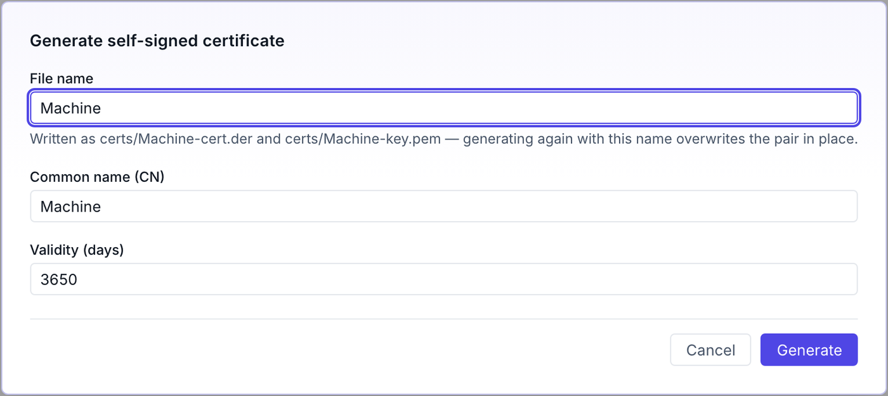
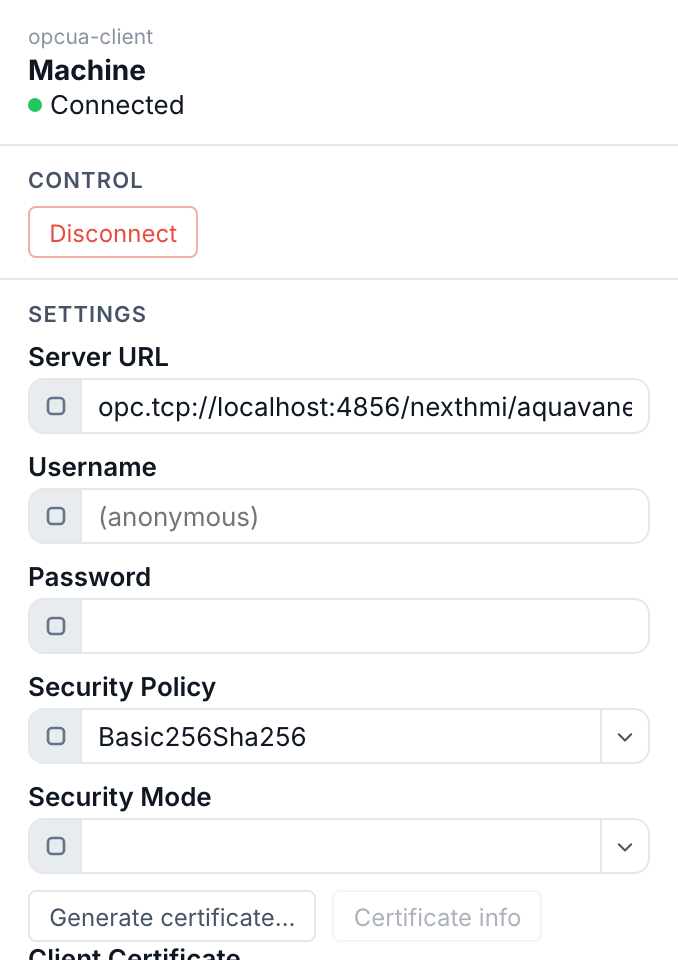

# Connecting to data

A **datasource** is a named connection with a tree of variables under it. Connect to a PLC over OPC-UA with the guided wizard, or use a static datasource to mock values while you design. Then browse the address space into a tree your pages can bind to.

## Connect to a PLC with the OPC-UA wizard

The connection wizard walks three steps — **Connection**, **Sign-in**, **Sync** — and can discover a server's endpoints for you.

1. **Enter the server address** — On the **Connection** step, type the endpoint — `opc.tcp://192.168.1.10:4840` (or just `host:port`). Give the datasource a **name** like `LinePLC`; that name becomes the prefix in every binding (`LinePLC:…`).
2. **Discover endpoints (optional)** — Click **Discover endpoints instead** and then **Discover**. NEXT HMI queries the server and lists each endpoint with its **security policy**, **mode**, and accepted **user tokens**. Pick one — the most secure is preselected — and its security settings fill in for you.
3. **Choose how to sign in** — On **Sign-in**, pick **Anonymous** or **Username & password**. The wizard offers only what the chosen endpoint actually accepts.
4. **Test, then create** — On **Sync**, hit **Test connection** — a green *Connected — <server name>* confirms it. Create the datasource; it starts connecting immediately, and you can jump straight to **Browse variables**.

> [!NOTE]
> Under the hood an `asyncua` client pool handles the session.

## Secure the connection with certificates

Pick anything other than **No Security** as the **Security Policy** and the
connection needs a client certificate — the identity your HMI presents to the
server. The certificate fields appear on the wizard's **Sign-in** step as soon
as a secured policy is chosen, and on the datasource's properties panel under
**Settings**, so an existing connection can be secured later without rebuilding
it.

You have two ways to get that certificate in place.

1. **Generate one here** — Click **Generate certificate…**. Give it a **File
   name**, a **Common name (CN)** and a **Validity** in days (ten years by
   default). NEXT HMI writes a self-signed RSA-2048 pair into the project's
   `certs/` folder — `certs/<name>-cert.der` and `certs/<name>-key.pem` — and
   fills the **Client Certificate** and **Client Private Key** fields in for
   you. DER is the encoding an OPC-UA PKI store (UaExpert, Optix, …) imports.

   

2. **Upload one you already have** — Use the file pickers on **Client
   Certificate**, **Client Private Key** and **Server Certificate**. Each
   upload is stored in `certs/` under a sanitised filename. A **Private Key
   Password** field sits beside them for an encrypted key; it stays a plain
   setting and is never uploaded as a file.

Whichever route you take, the server has to **trust** the certificate before it
will accept the session. Most servers park a first, rejected connection
attempt in a *rejected certificates* folder — move it to the trusted list
there, then connect again.

**Check what you have.** **Certificate info** reads the certificate back and
shows its subject, its fingerprint, when it was issued and when it expires, its
subject alt names, and whether it is self-signed. The status line is the part
to watch: *Valid*, *Expires in N days* inside the 90-day warning window, or
*Expired N days ago*. The button stays disabled until a certificate path is
set, and a path holding no readable certificate says so plainly rather than
failing.

> [!TIP]
> **Renewing is re-generating.** Generating again with the same **File name**
> overwrites the pair in place rather than accumulating files — so an expiring
> certificate is one click, followed by re-trusting it on the server.

## Connect, disconnect, and see why it failed

An OPC-UA datasource's properties panel opens with a **Control** section
holding **Connect** and **Disconnect**. They do what they say: the connection
stays down until you ask for it, and stays down after you disconnect rather
than quietly retrying. The button reads *Connecting…* / *Disconnecting…* while
the change is in flight.

The panel header carries the state beside the datasource name — a green dot and
**Connected**, or **Disconnected**. When a connect attempt fails, the reason
from the server is printed underneath it: a refused certificate, a bad
username, an unreachable host. That message is the first place to look when a
screen shows no data; [Diagnostics](diagnostics.md) covers the rest.

> [!NOTE]
> **The local test server is started the same way.** A test-server datasource
> shows **Running** / **Stopped** instead, with its own start and stop buttons.
> Its **Security Endpoints** checkboxes decide which secured policies it
> advertises — NoSecurity is always available — which is how you exercise the
> discovery and certificate flow above without a real PLC on the bench.

## Design offline with a static datasource

No PLC handy? A **static** datasource is a variable tree you define by hand, with no connection behind it. Bindings, writes and actions behave exactly as they will against a live server, so you can build and demo a whole screen set before the panel is wired.

1. **Add it** — Click the `+` on the **Datasources** row and choose **Static Variables**. Name it (`Demo`, `Line1Mock`) — the name is the binding prefix, same as for a real connection.
2. **Add variables** — Right-click in the variable table and pick **Variable**, **Folder**, **Array** or **Array Struct**. A folder groups variables; an array asks for its length.
3. **Fill the row in** — **Display Name**, a **Data Type** from the simple list (`Boolean`, `Integer`, `Float`, `String`, `DateTime`, …), and **Access** — mark it writable if a control should push values to it. NEXT HMI records a representative OPC-UA type behind your choice, so nothing changes in your pages when you swap in a real server later.
4. **Watch the values** — Toggle **⚡ Live** in the toolbar for a **Value** column showing what each variable holds right now.

> [!NOTE]
> **Static values live in memory only.** Every variable starts at its type's zero value (`0`, `false`, `""`) and holds whatever the HMI writes to it while the project runs. Nothing is written to disk, so a restart puts the whole tree back to zero — the definitions persist, the values don't.

## Browse the address space into a tree

Open the datasource and browse. Each variable is recorded with its real OPC-UA **data type**, whether it's **writable**, and (for arrays) its **length**. Variables live in a tree of four bindable shapes plus organising folders:

| Node | What it is | Binds as |
|---|---|---|
| **Scalar** | A single value. | one number / string / bool… |
| **Array** | A scalar repeated N times. | the whole array, or one element by `index` |
| **Struct** | A folder that holds variables — a named group. | the whole object, or a member by path |
| **Struct array** | A struct repeated N times. | the array of objects, or one struct |
| **Folder** | Pure organisation (only folders inside). | not bindable |

OPC-UA's many numeric types collapse to five simple ones at the HMI boundary — every `Int16/UInt32/…` becomes `Integer`, every `Float/Double` becomes `Float` — so a widget field never sees a wire type.

Next: [bind and subscribe →](subscribing.md)
