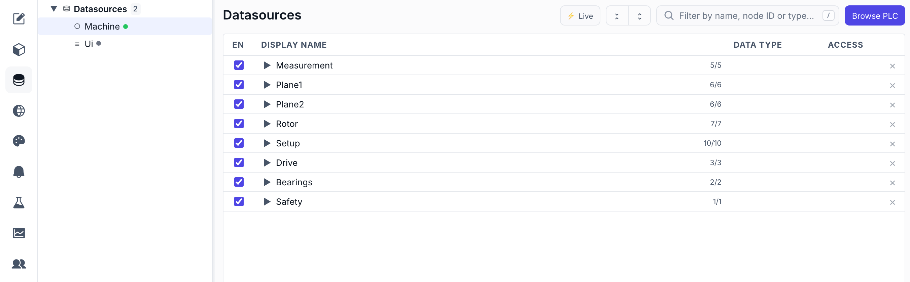

# Connecting to data

A **datasource** is a named connection with a tree of variables under it. Connect to a PLC over OPC-UA with the guided wizard, or use a static datasource to mock values while you design. Then browse the address space into a tree your pages can bind to.

## Connect to a PLC with the OPC-UA wizard

The connection wizard walks three steps — **Connection**, **Sign-in**, **Sync** — and can discover a server's endpoints for you.

1. **Enter the server address** — On the **Connection** step, type the endpoint — `opc.tcp://192.168.1.10:4840` (or just `host:port`). Give the datasource a **name** like `LinePLC`; that name becomes the prefix in every binding (`LinePLC:…`).
2. **Discover endpoints (optional)** — Click **Discover endpoints instead** and then **Discover**. NEXT HMI queries the server and lists each endpoint with its **security policy**, **mode**, and accepted **user tokens**. Pick one — the most secure is preselected — and its security settings fill in for you.
3. **Choose how to sign in** — On **Sign-in**, pick **Anonymous** or **Username & password**. The wizard offers only what the chosen endpoint actually accepts.
4. **Test, then create** — On **Sync**, hit **Test connection** — a green *Connected — <server name>* confirms it. Create the datasource; it starts connecting immediately, and you can jump straight to **Browse variables**.

> [!NOTE]
> Under the hood an `asyncua` client pool handles the session. For encrypted endpoints, certificates are configured afterwards in the datasource's **Security** settings.

## Design offline with a static datasource

No PLC handy? A **static** datasource is a variable tree you define by hand, with no connection behind it. Bindings, writes and actions behave exactly as they will against a live server, so you can build and demo a whole screen set before the panel is wired.

1. **Add it** — Click the `+` on the **Datasources** row and choose **Static Variables**. Name it (`Demo`, `Line1Mock`) — the name is the binding prefix, same as for a real connection.
2. **Add variables** — Right-click in the variable table and pick **Variable**, **Folder**, **Array** or **Array Struct**. A folder groups variables; an array asks for its length.
3. **Fill the row in** — **Display Name**, a **Data Type** from the simple list (`Boolean`, `Integer`, `Float`, `String`, `DateTime`, …), and **Access** — mark it writable if a control should push values to it. NEXT HMI records a representative OPC-UA type behind your choice, so nothing changes in your pages when you swap in a real server later.
4. **Watch the values** — Toggle **⚡ Live** in the toolbar for a **Value** column showing what each variable holds right now.

> [!NOTE]
> **Static values live in memory only.** Every variable starts at its type's zero value (`0`, `false`, `""`) and holds whatever the HMI writes to it while the project runs. Nothing is written to disk, so a restart puts the whole tree back to zero — the definitions persist, the values don't.

## Browse the address space into a tree

Open the datasource and browse. Each variable is recorded with its real OPC-UA **data type**, whether it's **writable**, and (for arrays) its **length**. Variables live in a tree of four bindable shapes plus organising folders:

| Node | What it is | Binds as |
|---|---|---|
| **Scalar** | A single value. | one number / string / bool… |
| **Array** | A scalar repeated N times. | the whole array, or one element by `index` |
| **Struct** | A folder that holds variables — a named group. | the whole object, or a member by path |
| **Struct array** | A struct repeated N times. | the array of objects, or one struct |
| **Folder** | Pure organisation (only folders inside). | not bindable |

OPC-UA's many numeric types collapse to five simple ones at the HMI boundary — every `Int16/UInt32/…` becomes `Integer`, every `Float/Double` becomes `Float` — so a widget field never sees a wire type.

## Give a numeric variable a range

Every numeric row in the variable table — on a PLC connection as much as on a static datasource — has a **Min** and a **Max** cell. Type a bound into either, leave the other blank if only one end is real, and clear a cell to drop the limit again. Both columns stay empty on booleans, strings and dates, where a range means nothing.

The range is a property of the *variable*, so it only has to be set once:

- **Writes are rejected outside it.** A value below **Min** or above **Max** never reaches the controller, and the operator gets a *Value is outside the allowed range* message instead of a silent no-op.
- **Bound controls inherit it.** Number Input and Numeric Stepper clamp their numpad and their `+`/`−` buttons to the variable's range whenever the widget's own **Min value** / **Max value** fields are left empty — set the range here and every control bound to that variable picks it up.

A **Min** above the **Max** is refused as you type: the cell turns red and nothing is stored until you fix it or press `Esc`. Struct fields get their own range the same way — set it on the field's row inside the folder, not on the folder.

Next: [bind and subscribe →](subscribing.md)
