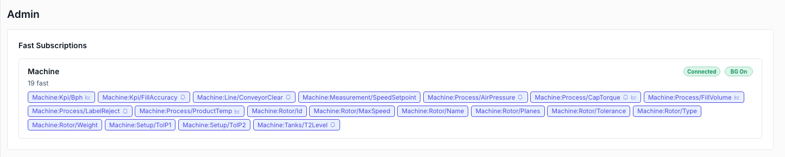

# Diagnostics & troubleshooting

When a value doesn't arrive, a widget doesn't render, or a save doesn't stick, NEXT HMI already knows why — this chapter is a map of where it says so. Two panels do most of the work: the editor's **Admin** area for what the project is doing right now, and the manager's **Settings** page for what the installation is doing.

## The Admin area (per project)

Pick **Admin** in the editor's left rail. Three live sections, refreshed while you watch.

### Fast Subscriptions

One card per OPC-UA datasource, each showing **Connected** / **Disconnected**, whether background polling is on, and every tag currently on the *fast* subscription — the ones refreshed first. Icons mark **why** a path is there: a bell for an alarm trigger, a chart for a historized variable; anything else is on the list because a visible widget binds it.

This is the panel that answers "why is my tag not updating?" — if the path is not listed, nothing is subscribed to it, and the answer is upstream (nothing binds it, its variable is disabled on the datasource, or the datasource is down).

### Custom Widgets

Every widget found in the project's `custom-widgets/` folder, with its build **Status** (OK / failed / unknown), whether it has CSS, and when it was compiled. **Recompile** one, or **Recompile all** — the route out of a stale build after editing files on disk. A failed build shows the compiler's own error message. See [Building your own widgets](custom-widgets.md).

A third state sits between the two: **No schema**. The widget compiled and renders fine, but its `schema` / `exportedProperties` exports could not be read, so the editor offers no property fields and no exported properties for it. The message underneath says why. Other widgets are unaffected — one unreadable widget no longer costs the rest their schemas.

### Connected Runtimes

Every open operator screen against this project: its **scope**, the **user** signed in there, that user's **groups**, and when it connected. Use it to confirm that the panel by the line really is signed in as `operator` and not still sitting on `guest`.

## The manager's Settings page (per installation)

Sign in to the manager dashboard and open **Settings** — this is installation-wide, not per project.

| Section | Gives you |
|---|---|
| **System Information** | Backend uptime, Python version, process id. First stop after "did it restart?" |
| **Runtime home** | Where per-installation state lives — the manifest, logs, the widget-build cache, TLS material. See [Installing and running](install.md#runtime-home). |
| **Logs** | Opens the **Application logs** viewer: the last 500 lines with the log file's path, a **Refresh**, and **Download full log** for the whole file. |
| **Security** | Change the **device-admin password** that gates the dashboard itself. |
| **HTTPS** | Certificate status, regenerate or upload your own, and restart into TLS. Full walkthrough in [HTTPS](install.md#https). |

## The warnings pill

The editor header runs a project-wide validation pass and shows a pill with the findings. Click it for the list; click a finding to jump straight to the widget, page, component, translation or custom widget it belongs to.

It reports things that are wrong but not fatal — a `$var` binding that names a variable no datasource offers, an alarm with no source value, a recipe parameter that is unbound, a user in a group that no longer exists, a historian setting out of range, a custom widget that failed to compile. Saving is never blocked: a half-built screen is a normal state mid-edit.

Two findings are specific to reusable components:

- **"component has no slot 'x'"** — the widget names a slot the component no longer declares, so it renders in the component's first slot instead. Drag it into the group you meant, or put the slot back. A widget placed on a component that declares *no* slots renders nowhere and is flagged the same way.
- **"`$componentProp` is only substituted as a property's whole value"** — inside the component, a `$componentProp` is nested in another source or sits on a Layout field. It fills in once and then stops updating. See [Passing values into components](properties.md#passing-values-into-components).

> [!NOTE]
> While you have unsaved edits, the pill can only re-check the artifact you have open. Save to get the whole project re-validated.

## Common symptoms

**A bound field is blank or dimmed.** The runtime distinguishes three failure states, and they mean different things — *absent* (the source can't produce a value yet), *bad quality* (connected but the tag reports bad/uncertain/stale), and *disconnected* (the whole datasource is down, which degrades every tag it owns). The table in [Binding & subscribing](subscribing.md#what-happens-when-data-goes-bad) says which is which.

**A value never updates, and never goes bad either.** Check **Fast Subscriptions**: a tag that appears nowhere is not subscribed. Common causes: the variable is not enabled in the datasource's variable table, the binding points at a path that was renamed on the PLC (the browse-diff banner in the Datasources area flags this), or the widget binding it is not on a visible page.

**A write is rejected.** The reason code tells you which layer refused: `permission_denied` (the signed-in user's groups are outside the variable's allowed set — see [Users](users.md#enforcement-and-where-it-really-happens)), `opcua_unreachable`, `write_failed`, `invalid_value`, `bad_path`. Attach an `onFailed` handler with a **Show Toast** of `{ $result: "reason" }` and the panel tells the operator directly — see [Actions](actions.md#async-actions-and-result).

**A custom widget doesn't appear, or renders the old version.** Check its status in **Custom Widgets** and hit **Recompile**. A widget whose source imports React or an app helper will not build — the SDK globals are the only allowed route.

**Nothing on the page reacts after editing files on disk.** The editor and runtime react to saves made *through* the app. If you edited a page, component or datasource file directly on disk, restart the backend so it re-reads them.

**The editor won't open for a user.** Editor access is a group test — **Users → Settings → Config access**. A user outside those groups gets no editor, by design.

**A save reports a failure.** Saves are per-area, and a failure names the area that refused rather than silently dropping the whole batch. Translations in particular refuse a save that would overwrite someone else's newer edit; reload and re-apply.

## Log files

Application logs live under the runtime home in `.logs/`. Read the tail in the viewer, or **Download full log** and grep it. When reporting a problem, that file plus the backend uptime and version from **System Information** is what makes a report actionable.
