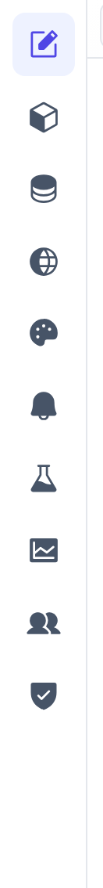

# The editor workspace

Every part of a project is edited in the same shape: a tree on the left, a working area in the middle, a properties panel on the right. Learn it once and it applies to pages, datasources, alarms — everything.

## The config areas

The editor's left rail switches between the areas that make up a project, top to bottom. Each opens the same tree / editor / properties layout, scoped to that subject.

- **Editor** — The screen tree — pages, groups, dialogs and the shell regions operators navigate. [How-to →](pages.md)
- **Components** — Reusable page fragments you build once and place with input properties, and with **slots** for widgets the page supplies. [How-to →](properties.md#passing-values-into-components)
- **Datasources** — OPC-UA connections and static data. [How-to →](datasources.md)
- **Translations** — The message catalog behind every `$loc` key, per language. [How-to →](translations.md)
- **Themes** — Colors, type, spacing and radii as tokens. [How-to →](theming.md)
- **Alarms** — Condition-based definitions with acknowledgement. [How-to →](alarms-recipes.md)
- **Recipes** — Parameter sets you download to and upload from live variables. [How-to →](alarms-recipes.md#build-a-recipe)
- **Historian** — Which variables are logged, at what rate, and for how long. [How-to →](historian.md)
- **Users** — Accounts and groups driving who can see and interact with what. [How-to →](users.md)
- **Admin** — Live diagnostics for this project: fast subscriptions, custom-widget build status, connected runtimes. [How-to →](diagnostics.md#the-admin-area-per-project)

Installation-wide settings — the runtime home, HTTPS, the device-admin password, logs — are not here; they live on the **Manager**'s Settings page. See [Diagnostics](diagnostics.md#the-managers-settings-page-per-installation).

The canvas in the middle is a **live preview** — every edit renders exactly as an operator will see it.

## Saving your work

Edits are held in the editor until you save them, so you can undo freely before anything touches disk.

| Control | Does |
|---|---|
| **Save** (Ctrl/Cmd + S) | Writes every pending change across all areas. The header shows *● Unsaved changes* until you do. |
| **Undo** (Ctrl/Cmd + Z) · **Redo** (Ctrl/Cmd + Y or Ctrl/Cmd + Shift + Z) | Step back and forward through the edit history. |
| **Save users** · **Discard users** | Accounts and groups save separately — a security change is never mixed into a normal save. These appear in the header only while that draft is dirty. |

Closing the tab with unsaved work prompts you first. Once a save lands, the server writes the project files and broadcasts a `config_changed` message, so every open runtime picks the change up on its own — there is no separate publish step.

> [!NOTE]
> **Two different "saves".** A **custom widget** is a file you edit outside the editor; the backend compiles it the moment you save the `.tsx` and hot-swaps it into open pages. That is unrelated to the editor's Save button. See [Building your own widgets](custom-widgets.md).

## Keyboard shortcuts

| Keys | Does |
|---|---|
| **Ctrl/Cmd + S** | Save every pending change. |
| **Ctrl/Cmd + Z** | Undo. |
| **Ctrl/Cmd + Shift + Z** · **Ctrl/Cmd + Y** | Redo. |
| **Ctrl/Cmd + C** · **Ctrl/Cmd + V** | Copy / paste — the **property** when one is selected in the panel, otherwise the selected **tree node** (widget, page, dialog, component) with everything under it. |
| **Ctrl/Cmd + X** | Cut the selected tree node: the next paste **moves** it instead of copying it, keeping its id. |
| **Enter** · **Escape** | Commit / cancel an inline rename, a table cell, or a modal. |

## Working habits worth knowing

- **Copy & paste crosses the tree.** A copied widget pastes into another page; a copied property value carries its source and all its nested bindings with it, onto any compatible field.
- **Copy duplicates, cut moves.** A paste after **Copy** is a new node with fresh ids; a paste after **Cut** is the same node in a new place, so anything bound to its id still resolves. Dragging a row does the same move — drop on the middle of a row to go inside it, on its top or bottom edge to sit beside it.
- **Preview at any size.** The viewport selector switches the canvas between **Fit to screen**, **Laptop** (1440×900), **Tablet** (1024×768) and **Phone** (390×844) so you can check responsive branches.
- **Try the screen without leaving the editor.** The preview toolbar's **Mode** control has two buttons: the pencil is **Config mode**, where a click selects the widget you clicked, and the play button is **Test mode**, where clicks run actions and navigation works — press your own buttons, open your own dialogs, watch a write land.
- **Watch the warnings pill.** The header runs a project-wide validation pass and surfaces findings — an incomplete `$var` binding, a reference to a datasource that no longer exists — without blocking the save. Click a finding to jump to it; see [Diagnostics](diagnostics.md#the-warnings-pill).
- **Open the runtime beside it.** The header's second button opens this project's operator runtime in a new tab, so you can keep a real screen open while you edit.
