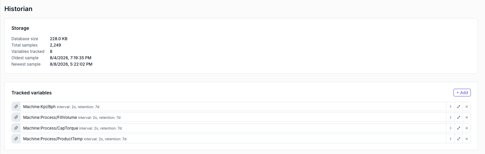

# Historian & trends

The historian records tag values to disk so operators can look *back*, not just at now. Pick the variables worth keeping, set how often each is sampled and how long it is kept, then put a **Trend Chart** on a page to plot them.



## What it records, and where

Every enabled variable is sampled as a number and appended to a local SQLite database at `<project>/historian/history.db`, with the picking rules in `<project>/historian/config.json`.

- **Only numeric scalars can be logged.** `Integer`, `Float` and `Boolean` variables qualify (a Boolean is stored as `0` / `1`). Strings, structs and arrays-as-a-whole do not — the variable picker only offers what it can store. One element of an array is fine: pick the index and the row is logged as `datasource:path[0]`.
- **A logged variable is subscribed whether or not it is on screen.** Enabling it here puts it on the fast OPC-UA subscription, so a tag that no page binds and no alarm watches is still recorded.
- **The database is local to this installation.** It is deliberately left out of exports, zips and peer transfers — the *configuration* travels so the other machine knows what to log, the samples stay behind. See [Managing projects](projects.md#download--upload-a-project).

## Choose what to log

1. **Open the Historian area** — Pick **Historian** in the editor's left rail.
2. **Add a variable** — Click **+** on **Tracked variables** and choose the tag from the variable picker. It is added enabled, expanded and ready to configure.
3. **Set the sampling** — Open the row and fill in the two fields that matter:

| Field | Means |
|---|---|
| **Logging** | **On** / **Off** without losing the row's settings. Off also drops it from the fast subscription. |
| **Minimum interval** | Seconds between samples for this tag. `0` logs every change the PLC reports — right for a step-change flag, wrong for a noisy analogue. |
| **Retention** | Days of history kept. Older samples are deleted by a cleanup pass that runs hourly. Default 30 days. |

Each collapsed row shows its own summary — `interval: 5s, retention: 30d` — so the whole logging plan is readable at a glance.

> [!TIP]
> **Interval is the storage dial.** One tag at `0` on a chatty analogue can outweigh fifty tags at `5`. Start at 1–5 seconds for process values and only go lower where you genuinely need the resolution.

## Watch the storage

The **Storage** panel at the top of the area refreshes every few seconds and answers "is this sustainable?" directly: **Database size**, **Total samples**, **Variables tracked**, and the **Oldest** / **Newest** sample timestamps. If the oldest sample is much younger than your retention setting, the cleanup pass is doing its job — or the project has not been running that long.

A row whose variable no longer exists on any datasource is flagged red and stops being logged. Re-point or remove it.

## Put a trend on a page

Add a **Trend Chart** widget ([catalog](catalog.md#trend-chart)) and set:

- **Variables** — a comma-separated list of the keys to plot, in `datasource:path` form: `LinePLC:Motor1/Speed, LinePLC:Motor1/Temp`. They must be the same keys you added in the Historian area — a tag that is not logged has nothing to draw.
- **Default time range** — the window the chart opens on, from **1 min** to **30 days**.
- **Refresh interval (s)** — how often it re-queries. `10` by default; `0` freezes it on the first query, which suits a report screen.
- **Show zoom buttons** — adds the range controls so the operator can widen or narrow the window themselves.
- **Line colors** — comma-separated colours matched to the variable list in order (`#2563eb, #dc2626`). Leave it empty to use the theme's series colours.

Long windows are **downsampled** before they reach the browser — a 30-day query returns a few hundred points, not a million — so the widget stays responsive at any range.

## Read the history from outside

The same store is queryable over REST, which is the route for a report generator or an MES:

```
GET /api/historian/query?variables=LinePLC:Motor1/Speed&start=-8h&end=now&maxPoints=500
```

`start` and `end` take an ISO-8601 timestamp, a relative offset (`-30m`, `-2h`, `-7d`), or `now`. The response is one series per variable, each a list of `{ t, v }` points.
