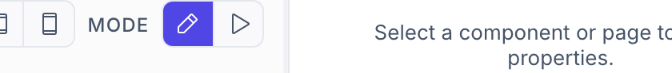

# Layout & responsive design

Layout is flex-based, not pixel-nailed. You group widgets in containers, decide how each child grows and aligns, and let the runtime reflow. Then you branch the layout by screen size so one project serves phone, tablet and panel PC.

## Build layout with containers

1. **Add a Container** — Drop a **Container** where you want a group. Set its **Direction** — `row` or `column` — plus **Gap**, and **Align items** / **Justify content**.
2. **Nest your widgets** — Move widgets into the container in the tree. They flow in order along the direction you chose.
3. **Tune each child** — Select a child and set its own layout fields — **Basis** (starting size), **Grow** (share of leftover space), **Shrink**, and a **Min width** / **Min height**. This is how you get "this panel fixed, that one fills the rest".

> [!TIP]
> Use a **Stretch Spacer** to push widgets apart (by ratio or percent) and a **Fixed Spacer** for an exact pixel gap — cleaner than padding hacks.

## The layout fields

Every widget's properties panel has a **Layout** section. It shows two groups: how this widget arranges *its children* (containers only), and how this widget *places itself* in its parent.

**Arranging children** — Direction · Gap · Wrap · Align items · Justify content · Padding (and per-side Padding top/right/bottom/left) · Radius.

**Placing itself** — Width · Height · Min width · Max width · Min height · Align self · Basis · Grow · Shrink · Margin (and per-side Margin top/right/bottom/left).

Length fields take any CSS length — `200px`, `100%`, `12rem`, `auto` — so you can mix fixed and proportional freely. Leave a field empty and it inherits: Radius falls back to the theme's `--hmi-radius` rather than to a hardcoded value.

Layout fields are properties like any other, so they can be **bound**. A sidebar's width driven by `$if`, a gap that changes with `$viewport` — no CSS involved.

## Persistent chrome: shell regions

A page's content scrolls, but navigation and status shouldn't. The **shell** wraps every page with four fixed regions you fill once:

- **Header ▣** — Top bar — page title, alarm summary, language switcher.
- **Left / Right sidebar ◧ ◨** — Navigation menu, quick actions, live KPIs.
- **Footer ▄** — Status line, connection state, clock.
- **Content** — The active page renders here; the shell stays put around it.

Each region appears in the page tree above the page list. Select one and its properties give you the region's behaviour, not just its contents:

| Setting | Does |
|---|---|
| **Enabled** | Whether the region exists at all. |
| **Expanded size** · **Collapsed size** | The region's size in each state — width for a sidebar, height for header/footer. |
| **Expanded** | Whether it is currently open. Bindable, so a menu-toggle button or a tag can drive it. |
| **Default state** | `expanded`, `collapsed`, or `hidden` on load. |
| **Overlay** | When expanded, float over the content instead of pushing it aside — the usual choice on a phone. |
| **Full height** (sidebars) | Span the whole layout height, flanking the header and footer instead of sitting between them. |
| **Background** | The region's background colour. |

Those settings are project-wide. A single page can override them in its own properties, under **Shell override (this page only)** — one toggle per region, hiding it for that page. That's how you get a full-screen trend or a login screen with no navigation at all, without touching the rest of the project.

Project-wide shell settings also cover the browser **tab title**, the **favicon** (a path under `assets/`, see [Files & assets](files.md)), an **HMI scale** factor that zooms the entire layout for a small or very large panel, and **Locked feedback** — what an operator gets when they press a widget that is not **Interactable** (see [Users, groups & access](users.md#what-a-locked-widget-does)). The boot screen's branding is fixed in the open-source build (see [Licence](licence.md#the-attribution-notice)).

## Place freely over an image

For a P&ID, a floor plan, or a machine photo, use an **Image Container** instead of a flex Container. It hosts children at **absolute positions** on top of a background image — a valve indicator here, a temperature readout there. Set **Fit** for how the image scales, and **Collapse below** to a pixel width under which the absolute placement is abandoned and children stack normally, so a phone doesn't get a postage-stamp overview.



## One project, every screen size

Rather than maintaining separate designs, branch any property on the **viewport**. Bind it with `$viewport` and choose a value per size class — no media-query CSS anywhere.

```
// stack on a phone, sit side-by-side on a laptop
"direction": {
  "$switch": {
    "value": { "$viewport": { "field": "size" } },
    "cases": [
      { "when": "phone",  "then": "column" },
      { "when": "tablet", "then": "column" }
    ],
    "default": "row"
  }
}
```

`$viewport` also exposes `orientation`, `width` and `height`. Preview the result with the viewport selector's **Phone / Tablet / Laptop** presets before you ship.

A few patterns worth reaching for:

- **Collapse the sidebar on small screens** — bind the region's **Overlay** and **Default state** to `$viewport`, and put a **Menu Toggle Button** in the header.
- **Hide detail rather than shrink it** — bind a widget's `visible` to `$compare` against `$viewport`'s `width`. A cramped widget reads worse than an absent one.
- **Scale, don't redesign, for an odd panel** — the shell's HMI scale factor handles a 7" panel or a 4K wall display without touching a single layout field.
