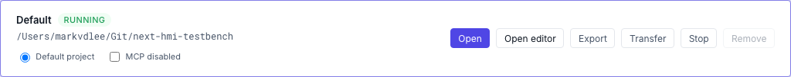

# AI agents over MCP

NEXT HMI speaks **MCP** (Model Context Protocol), so an AI assistant can read and edit a project the same way you would in the editor — add pages, place widgets, wire bindings, add alarms, fill in translations. It is off for writes by default, and you decide per project.

The assistant talks to *your* installation directly: your project files never pass through a NEXT HMI service, and there is nothing to sign up for. What the endpoint hands out is exactly what the client asks for, over your own network.

## How it fits together

One endpoint covers the whole installation:

| Setup | Endpoint |
|---|---|
| HTTP (default) | `http://<manager-host>:8000/mcp/` |
| [HTTPS](install.md#https) turned on | `https://<manager-host>:8443/mcp/` |

**Either spelling works.** `/mcp/` is the canonical path; a bare `/mcp` is rewritten onto it rather than redirected, because most MCP clients do not follow redirects. On an older build that still redirects, use the trailing slash.

**Client and manager on the same machine?** Then `<manager-host>` is `127.0.0.1` — the manager binds loopback only unless `NEXTHMI_HOST` says otherwise, so `http://127.0.0.1:8000/mcp/` is the whole endpoint. The `hmi.local` examples further down are for the case where the client sits on another machine.

> [!IMPORTANT]
> With HTTPS on, port `8000` answers with a `307` redirect rather than the app — and most MCP clients do not follow redirects. Point the client at the HTTPS port directly. See [Ports](install.md#ports). If the certificate is the self-signed one the manager generated, the client must be told to trust it; a client that validates certificates will otherwise refuse to connect.

It is served by the **manager**, the only process that sees every project, so an agent connects once and never reconfigures as projects start, stop or get created. Every tool call names which `project` it acts on, so one session can work across several.

A project does **not** need to be running to be edited — the tools work on the files. If the project *is* running, each write is pushed to the live instance, which re-reads the affected files and tells every connected browser.

## Turn it on

### 1. Enable writes for the project

On the Manager dashboard, tick **MCP enabled** on the project's row. Off is the default. With it off, an agent can still *read* that project; every write is refused.



### 2. Find the project id

Pairing and every tool call name a project by **id**, not by its display name. The id is the slug in the project's own URLs — open the project and read `/runtime/<id>/` or `/editor/<id>/` from the address bar. It is also the `project.id` field in the project's `config.json`, and an agent with any token can call `projects_list` to see them all.

### 3. Pair a token

A headless client (an agent runner, a desktop assistant) has no manager session, so it authenticates with a bearer token. There is no button for this yet — mint one by presenting the **device-admin password**, the one you set on the dashboard at first launch (see [Managing projects](install.md#managing-projects)); it is the same password that unlocks the dashboard, not a project's operator password.

```bash
curl -X POST http://localhost:8000/api/manager/mcp/pair \
  -H 'Content-Type: application/json' \
  -d '{"password":"<device-admin>","projectId":"line-a","access":"write","name":"Claude"}'
```

On Windows PowerShell, where the single quotes above are not string delimiters:

```powershell
Invoke-RestMethod -Method Post -Uri http://localhost:8000/api/manager/mcp/pair `
  -ContentType 'application/json' `
  -Body '{"password":"<device-admin>","projectId":"line-a","access":"write","name":"Claude"}'
```

Send the body as BOM-free UTF-8. Building it with PowerShell's `Out-File` or `Set-Content` and posting the file writes a byte-order mark ahead of the `{`, and the server rejects it with a JSON parse error pointing at *line 1 column 1* — pass the JSON inline as above, or write the file with `[IO.File]::WriteAllText`, which does not add a BOM.

The response carries the token **once** — only its hash is stored, so a lost token cannot be recovered, only replaced. A token is scoped to exactly **one project** and to **read** or **write**; it can never reach another project.

### 4. Point the client at it

Claude Code, from a terminal:

```bash
claude mcp add --transport http nexthmi https://hmi.local:8443/mcp/ \
  --header "Authorization: Bearer <token>"
```

Clients configured by file want the same three facts — transport, URL, header:

```json
{
  "mcpServers": {
    "nexthmi": {
      "type": "http",
      "url": "https://hmi.local:8443/mcp/",
      "headers": { "Authorization": "Bearer <token>" }
    }
  }
}
```

`hmi.local` is an mDNS name and only resolves on a client that speaks mDNS — Linux needs `avahi`, Windows has no resolver of its own and needs Bonjour installed. If the name doesn't resolve, that is a plain DNS failure and not a certificate problem: use the machine's IP address, or add a `hosts` entry for it.

Working in a browser that is already signed in to the manager? Then the manager session is enough and no token is needed — you already have that privilege through the dashboard.

### 5. Try it

Ask for a read first, so a bad endpoint or a mis-scoped token shows up before anything is written:

1. *"List the pages in project line-a."* — exercises the connection, the token and the project id in one call.
2. *"What variables does the LinePLC datasource have?"* — confirms the agent can see your data model.
3. *"Add a page called Line overview with a heading and a button bound to LinePLC:Motor/Start."* — the first write. Watch the editor tab: the change lands on disk and any open editor offers to reload.

## Managing tokens

| Action | How |
|---|---|
| List issued tokens | `GET /api/manager/mcp-tokens` — returns id, name, project, access level and creation time; never the secret. |
| Revoke one | `DELETE /api/manager/mcp-tokens/<id>` |
| Revoke everything | Change the device-admin password. |

Because the secret is shown once, the way to check a token is still live is to look for it: `GET /api/manager/mcp-tokens` from a browser signed in to the dashboard lists the issued tokens (the call takes the manager session, not a bearer token), so a missing id means revoked and a present one means the fault is in the client's URL, header or scope. Confirm the rest with one `initialize` call against `/mcp/` before assuming the client is misconfigured.

Tokens do **not** expire on their own. One stays valid until it is revoked by id, or until the device-admin password changes — so treat a token handed to a laptop or a CI runner as live until you take it back.

## What an agent can do

| Area | Agent may |
|---|---|
| Pages, widget trees, widget properties | read + write |
| Variables on a datasource | read + write |
| Alarms (definitions) | read + write — groups are UI-only |
| Translations (languages, keys, cells) | read + write |
| Assets (icons, images) | read + write |
| Datasource connections and browsed trees | read only |
| Components | read only |
| Users — names, groups, enabled state | read only, never credentials |
| Widget-schema manifest | read only |
| Starting, stopping, creating, deleting projects | never — lifecycle stays an operator action in the dashboard, on purpose |

Destructive operations are two-step — the first call returns a diff to review, and only a second call with `confirm: true` applies it. Page edits also return a `warnings` list for advisory problems such as an incomplete binding or a reference to a variable that doesn't exist; the write still succeeds, so it's worth reading them.

The full tool catalog, argument shapes and limits are in the [MCP reference](../dev/reference/mcp.md).

## Starter prompts

The server ships four **prompts** — canned multi-step recipes that appear in your client's prompt or slash menu once connected, so you don't have to describe the whole workflow yourself. Each one takes the `project` id plus a couple of arguments:

| Prompt | Does | Arguments |
|---|---|---|
| **Scaffold a new page** | Creates a page and a starter widget tree from a one-line brief. | `project`, `brief`, `layout` (default `single-column`) |
| **Build a datasource dashboard** | Reads a datasource's variable tree and builds a page that visualises the important ones. | `project`, `datasource`, `max_widgets` (default 12) |
| **Seed alarms from a datasource** | Walks the boolean variables, picks the ones that name a fault, and writes alarm definitions into an existing group. | `project`, `datasource`, `group_title` (default `Auto-seeded`) |
| **Localize a page's strings** | Extracts the static strings on a page into a dictionary and rewrites the page to use `$loc` bindings. | `project`, `page_id`, `dict_name` (default `Default`) |

They are ordinary instructions, not privileged calls — the agent still works through the same tools and the same gates.

## While an agent is working

**Operator screens follow along.** A running project re-reads the changed files and pushes the update to every connected browser, so an HMI screen shows the new value or the new widget without anyone touching it.

**Editor tabs ask first.** An open editor shows a banner — *"Config was updated by another writer."* — with the choice to reload or dismiss, rather than yanking the canvas out from under you mid-edit. Dismissing keeps your tab as it is; your next save writes over what the agent did, so reload unless you know the two edits don't overlap.

## When it doesn't work

| What you see | What it means |
|---|---|
| `401` · *MCP requires a manager session or a valid MCP bearer token* | No `Authorization` header reached the server, or the token was revoked — including by a device-admin password change, which revokes every token. |
| *MCP token is not scoped to project '…'* | The token was paired for a different project. One token, one project — pair another. |
| *MCP token has read-only access* | Paired with `"access":"read"`. Access level is fixed at pairing; mint a `write` token. |
| *MCP writes are disabled for project '…'* | The token is fine, the project's **MCP enabled** tick is not. Step 1 above. |
| *Project '…' not found* while pairing | The `projectId` isn't a registered project id — you probably sent the display name. Step 2 above. |
| *Too many failed attempts. Try again in Ns.* | Wrong device-admin password on `/pair`; the same lockout that guards the dashboard login. Wait it out. |
| `404` on `GET`, `405` on `POST`, or a bare `307` | The URL reached the router but not the transport — add the trailing slash (`/mcp/`). Older builds redirect instead of rewriting, and a proxy in front can rewrite the path too. |
| Connection refused on `8443` | HTTPS was never turned on, so nothing listens there. Use the `8000` HTTP endpoint, or enable [HTTPS](install.md#https) first. |
| Host name doesn't resolve at all | `hmi.local` needs mDNS on the *client* — Bonjour on Windows, `avahi` on Linux. Use the IP address or a `hosts` entry instead. |
| Client cannot connect at all, no HTTP status | Usually the redirect or the certificate: HTTPS moves the app to `8443`, and a generated self-signed certificate isn't trusted by default. See the endpoint table above. |
| Agent claims a widget type doesn't exist | The widget-schema manifest can lag by one save cycle after a custom widget is edited. Re-save the widget and let the agent re-read the schemas. |

## Before you enable it

> [!IMPORTANT]
> An agent with a write-scoped token can change what operators see and what values get written to a PLC. Treat the endpoint as equivalent to editor access.

- **Keep it on a trusted network.** The endpoint is plain HTTP unless you've turned on [HTTPS](install.md#https). A bearer token crossing an untrusted network is a bearer token someone else can use.
- **Grant the narrowest scope that works.** A `read` token for an agent that only answers questions about the project; `write` only where you want edits.
- **Confirmation guards the agent, not you.** An agent can chain the dry-run and the confirm in a single turn without asking a human. The MCP toggle is the control that actually stops writes.
- **Attribution is best-effort.** Writes are labelled with the client's name, but any authenticated caller can set that label, so treat the log as advisory rather than proof.
