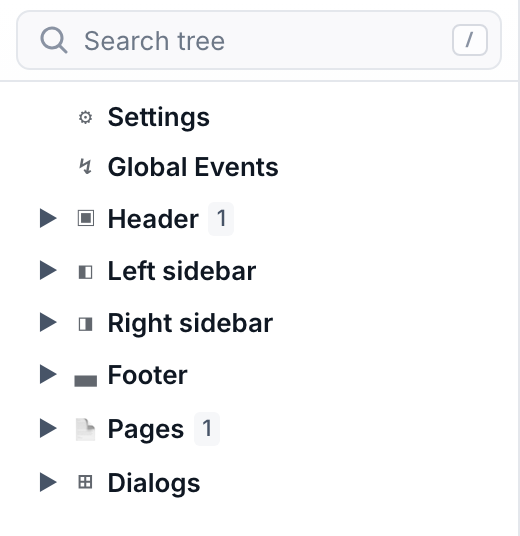

# Pages & navigation

Pages are the screens operators move between. They live in a tree of **pages**, **page groups** and **dialogs**. This chapter walks through building that tree and giving operators a way to navigate it.

## How the tree is organised

Open the **Editor** area in the left rail. The tree is a fixed set of collapsible sections, each with a `+` on its row:

| Section | Holds | `+` adds |
|---|---|---|
| **Header ▣** · **Left sidebar ◧** · **Right sidebar ◨** · **Footer ▄** | The shell regions that wrap every page — see [Layout](layout.md#persistent-chrome-shell-regions). | a widget to that region |
| **Pages** | The screen tree operators navigate. | a page or a page group |
| **Dialogs** | Modal overlays, not part of the page tree. | a dialog |

## Add your first page

1. **Add it** — Click the `+` on the **Pages** section row, or right-click inside the section and pick **Add Page**. A blank page appears, selected, with its properties open on the right.
2. **Name it** — Set the page **title** in the properties panel (or double-click the tree row to rename). The title feeds the browser tab, the `$page` source, breadcrumbs and menus.
3. **Fill in the details** — Give it an **icon**, a **breadcrumb label**, and a **description** as needed — navigation widgets read these automatically.

## Group, nest, and reorganise

The tree's right-click menu is where structure happens, and it changes with what you clicked. Use it to keep related screens together and to reshape the hierarchy as the project grows.

| Menu item | Where | What it does |
|---|---|---|
| `Add Page` | Pages section, page group | Create a page — at the root, or inside the group you clicked. |
| `Add Page Group` | Pages section, page group | Create a **page group** — a container that stacks its own pages and gets its own navigation. Groups can nest. |
| `Rename` · `Cut` · `Copy` · `Paste` | pages, groups, dialogs | The usual edits; paste drops a copied page (and its widgets) in place. |
| `Delete Page` · `Delete Page Group` · `Delete Dialog` | the matching node | Remove it. |

**Moving things.** Drag a row onto another: the **top or bottom quarter** drops it
before or after that row, the **middle half** drops it *inside* — into a page group, a
container, a page section, a shell area or a dialog. Hovering a collapsed row for a
moment opens it, so a drag can reach anywhere without preparing the tree first.

`Cut` (`Ctrl`/`Cmd`+`X`) then `Paste` does the same move from the keyboard, and both
keep the node's **id** — bindings that name it keep working. `Copy` + `Paste` is the
opposite: it duplicates, giving the copy fresh ids. Either way the move is a single
undo step.

> [!NOTE]
> **Dialogs are added from their own section**, not from the page right-click menu — click the `+` on the **Dialogs** row. They live outside the page tree because they open *over* whatever screen is current rather than being navigated to.

> [!NOTE]
> **Page groups vs. dialogs.** A *group* is for sets of sibling screens that share a navigator or tab bar (e.g. a wizard, or one screen per machine). A *dialog* is for a focused, dismissable task on top of the current screen (confirm, set a value, show detail).

## Dialogs, and passing values into them

A dialog is built exactly like a page — a widget tree, edited on the same canvas — plus a few of its own properties: a **title**, whether a **close button** shows, and whether clicking the backdrop closes it.

What makes a dialog reusable is that it can declare **input properties**, the same mechanism a Component uses. Declare `motorId` on the dialog, and the widgets inside read it with `$componentProp`; the **Open Dialog** action that opens it fills the value in. One "Motor detail" dialog then serves every motor on the plant instead of one dialog per machine.

The opening action also decides how it looks — **size** (auto / small / medium / fullscreen / fixed pixels), **placement** (centred, edge-docked, or anchored to the button that opened it, popover-style), and whether the backdrop **dims**. See [Actions](actions.md#screens).

## Page overlays: reuse a page as a modal

Sometimes the thing you want on top of the current screen already exists as a full page. Rather than rebuild it as a dialog, open it with the **Open Page Overlay** action: the page renders as a modal, with the same size, placement and backdrop choices, and closes with **Close Page Overlay**.

Rule of thumb — a **dialog** is authored to be a popup and can take input properties; a **page overlay** is an existing screen borrowed as one.

## Give operators a way around

You don't hand-wire links. Navigation widgets read the page tree and stay in sync as it changes. Add whichever fits the layout:

- **Navigation Menu** — A sidebar or top-bar menu that mirrors the page tree automatically. Choose orientation, icon/label display, flat vs. tree hierarchy, and how sub-menus expand.
- **Tab Bar** — Switches between the sibling pages of a group as tabs — ideal inside a page group.
- **Breadcrumb** — Shows the trail of pages leading to the current one, with an optional home icon.
- **Page Navigator** — Back / forward / up controls scoped to a page group's navigation stack.

Put these in a **shell region** (see [Layout](layout.md)) so they persist while operators move between screens.
