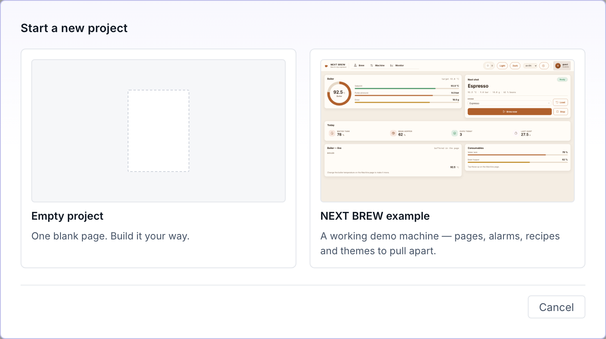

# Managing projects

A project is a self-contained folder of plain files. The **Manager** — the dashboard at the origin root — is where you create projects, register ones already on disk, start and stop them, and move them between machines.

## What's in a project folder

Everything the runtime needs is on disk, in formats you can read and diff. That's what makes a project portable and Git-friendly.

| Path | Holds |
|---|---|
| `config.json` | The page index, the shell, global events, and the project's own id and settings. |
| `pages/` | One JSON per page — the widget tree for that screen. |
| `dialogs/` | The same documents for the pages of the **Dialogs** folder — the screens an action opens as an overlay. See [Pages & navigation](pages.md). |
| `components/` | Reusable composite components you place with input properties. |
| `datasources/` | OPC-UA connections and static data, plus the browsed variable tree. |
| `alarms.json` · `alarm_state.json` | Alarm definitions, and the live acknowledgement state. |
| `recipes.json` · `recipe_state.json` | Recipe dataset types and datasets, and which dataset is loaded. |
| `themes/` · `translations/` · `users.json` | Tokens, [message catalogs](translations.md) per dictionary and language, and [accounts + groups](users.md). |
| `assets/icons/` · `assets/images/` · `assets/videos/` | SVG icons, images and videos referenced by widgets. See [Files & assets](files.md). |
| `custom-widgets/` | Your authored `.tsx` widgets. See [Custom widgets](custom-widgets.md). |
| `external-libraries/` | Third-party ESM bundles you import from widgets. |
| `certs/` | Per-project OPC-UA client certificates. |
| `historian/` | [Historian](historian.md) configuration plus this installation's local sample database. |
| `.backups/` | A zip of the whole project, taken automatically before a file-format upgrade rewrites anything. Yours to keep or delete — nothing reads them back, and they never travel with an export or a transfer. |

The backend creates any missing folder on startup, and never overwrites this tree on upgrade — it is your state, not the product's.

## The Manager dashboard

Browse to the origin root (`http://localhost:8000` by default) and sign in with the **device-admin password**. The dashboard lists every project registered on this installation, one row each, showing its name, its **id**, its folder, and its status.

The id is the project's address: it is what appears in `/runtime/<id>/` and `/editor/<id>/`, in the instance log folder, and in the scope of an MCP token. It is derived from the name when the project is created, and it stays put afterwards unless you change it deliberately — see **Rename** below.

Each row shows a picture of that project's main page as it looked the last time
the project was saved in the editor. A project that has never been saved shows
a plain placeholder instead. The picture is stored on this installation only —
it never travels with an export, a zip, or a transfer to another manager.

Each row carries the actions for that project:

| Control | Does |
|---|---|
| **Start** | Brings the project up as its own backend instance, with its OPC-UA connections. It becomes reachable at `/runtime/<id>/` and `/editor/<id>/`. |
| **Open** · **Open editor** | Once running, opens the operator runtime or the editor in a new tab. |
| **Stop** | Takes the instance and its connections down. |
| **Set as default** | Marks the project the origin root jumps to, and keeps it running. Handy on a panel PC that should boot straight into one screen set. |
| **MCP enabled / disabled** | Whether an AI agent on the workspace MCP endpoint may *write* to this project. Off by default. See [AI agents over MCP](mcp.md). |
| **Rename** | Changes the project's name, its id, or both. Only while the project is stopped. |
| **Export** | Downloads the whole project as a zip. |
| **Transfer** | Pushes this project to another NEXT HMI manager on the network. |
| **Locate…** | Appears only when the folder has gone missing — re-points the entry at its new location. |
| **Remove** | Unregisters the project. |

The set of running projects is remembered, so a restart brings the same ones back up. Several projects can run side by side — starting one does not stop another.

> [!NOTE]
> **A fresh project needs no credential of its own.** A project copied from the bundled seed has only the anonymous `guest` user, so it starts and opens straight away — the device-admin password that gets you into the dashboard also gates every project's runtime and editor. Add real accounts when you want them, from the editor's [Users](users.md) area. A project whose `users.json` is missing or corrupt is the exception: it shows **Credentials unavailable** instead of Start until the file is repaired on disk.

A project saved by an older build — or by one that predates the file-format stamp — has to be upgraded before it opens, so **Start** asks first instead of starting right away. Confirming zips the whole project into its `.backups/` folder before changing anything, and a one-time notice on the Projects page names what changed and where that backup landed. Declining leaves the project untouched. A project saved by a *newer* build shows **Requires update** in place of Start, naming the version it needs — update the application to that version or later. The file format only changes in a release whose second number moves, so a patch update (0.4.1 → 0.4.2) never makes a project unopenable elsewhere.

## How to create a project

Three ways in, all from the dashboard toolbar. Each adds a row to the runtime-home manifest — the files live wherever you point them.

1. **New project — pick a template first.** Click **+ New project**.
   **New project** first asks what to start from. **Empty project** gives you one
   blank page. **NEXT BREW example** gives you a working demo machine — three
   pages plus a Dialogs folder (an about dialog, a sign-in dialog and a
   five-page guided brew wizard), a static datasource, alarms, recipes, two
   themes and two languages — which is the fastest way to see how the pieces fit
   together before building your own. Its `onHmiLoaded` global event writes starting values into its
   datasource on load, so if you repoint it at a real server, look at that
   event first.

   

   Enter a **Project name** and a **Parent folder** (type it or **Browse…**); the modal previews the exact folder it will create. Confirm and NEXT HMI copies the chosen template into place and registers it.
2. **Add existing — register a folder on disk.** Click **⊕ Add existing** and give the **Project folder** path, e.g. `/opt/hmi/line-a`. The folder must already hold a `config.json` with a `project` block. Use this after cloning a project from Git or copying a folder onto the machine. The project is registered but not started.
3. **Import zip — unpack a shared build.** Click **↑ Import zip**, choose the **Zip file** and a **Destination folder**. See [Download & upload](#download--upload-a-project) below.

A project created or imported this way is never made the default automatically — that stays an explicit choice.

## Download & upload a project

The zip is the hand-off format: one file that carries the whole project, including its identity, so the other end registers it as the same project rather than a copy.

**Download (export).** **Export** on the project's row streams the folder out as `<name>.nexthmi.zip`. The compiled custom-widget cache (`widget-build/`) is skipped — it is regenerated on the far side — and so are the historian's local database files (`*.db`, `*.sqlite`, and their journals), the pre-upgrade zips in `.backups/`, and the whole `certs/` folder, all of which are installation-local. `certs/` holds an OPC-UA *private key*, which is never handed to anyone else; the receiver generates its own pair on first connect, and re-uploads any server certificate the datasource trusts. Historian *configuration* does travel, so the receiver knows what to log. Symlinks are never followed into the archive.

**Upload (import).** **↑ Import zip** takes the **Zip file** and a **Destination folder**, unpacks it into a new project folder, and registers it. The archive is hardened on the way in: path traversal and absolute paths are rejected, symlinks are dropped, and the total is capped by `NEXTHMI_MAX_PROJECT_ZIP_MB` (500 MB by default) so an oversize archive is refused before any bytes reach disk.

An archive has to actually hold a project: one carrying a `config.json`
metadata block but no `users.json` is refused on the way in, rather than
registering an entry that then refuses to start. Exporting such a project is
still allowed, so a damaged one can be carried somewhere else and repaired.

Because the id travels with the archive, importing a project that is *already* registered on this installation is refused with a conflict. Remove the existing entry first, or import onto a different machine.

## Push & pull between devices

**Transfer** (on a project row) pushes that project to another manager on the LAN; **⇩ Pull from peer** (in the toolbar) fetches one the other way. Both use the same packing code path as the zip, over the wire. The editor's top bar carries the same **Transfer** button for the project you have open — save your changes first, since only what is on disk travels.

Pair once with the destination's existing device-admin password; after that a revocable peer token authenticates the transfer. Discovery is by mDNS, and a peer can always be entered manually as `host:port` — a peer found both ways is offered once, not twice. The full trust model and the HTTPS certificate pinning are in [Installing and running](install.md#peer-transfer-over-https).

**When the far side already has that project.** The dialog checks before it
sends, so a clash on the project's **id**, its **destination folder**, or both
is named up front rather than surfacing as a failure. Pick how to resolve it:

| Resolution | Does |
|---|---|
| **Don't overwrite anything** | The default. The transfer is refused if anything is in the way. |
| **Install as a separate copy** | Installs alongside the existing project under a new id. |
| **Replace the existing project** | Overwrites it — only a stopped project, only after you confirm, and rolled back if the install fails partway. |

**When it fails anyway.** The dialog says what went wrong and what to do about
it, instead of printing a raw error: a wrong device-admin password (the
*peer's*, not this manager's), a pairing lockout with the countdown to wait
out, a host name that didn't resolve, an address outside the trusted LAN, a
port with nothing listening, a failed TLS handshake, or a peer certificate that
no longer matches the one pinned at first contact. Progress is named the same
way as it runs — packing, uploading, extracting, backing up, installing,
registering, starting.

> [!IMPORTANT]
> Transfer defaults to plain HTTP and assumes a trusted LAN. Serve the peer over HTTPS before sending anything across a network you don't control.

## Move, repair, and remove

- **Moved the folder?** The row goes to a **missing** status and grows a **Locate…** button — the one action still available, since every other one needs the folder that is gone. Give it the new path and the entry is re-pointed. The destination's `config.json` must carry the same project id, so a typo can't silently attach the entry to an unrelated tree.
- **Rename** changes the display name, the id, or both — stop the project first. The **name** is cosmetic. The **id** is the address: every `/runtime/<id>/` or `/editor/<id>/` bookmark pointing at the old one breaks, and any client using the old URL has to be updated. Everything on this installation follows along automatically — the manifest entry, the project's own `config.json`, the default-project choice, the instance logs and the MCP tokens issued for it. The folder on disk keeps its path; move it with **Locate…** if you want that renamed too. An id must start with a letter or digit and hold only letters, digits, `.`, `_` or `-`, and it cannot collide with another registered project.
- **Remove** unregisters the project. By default your files on disk are left alone and only the manifest row goes; tick **Also delete the folder on disk** in the confirmation to erase it too. Deleting the folder is refused if it has no `project` block in `config.json`, which stops a stale path from wiping something unrelated.
- A running project must be **stopped** before it can be removed.

## Licensing, in one line

The open-source build is AGPL-3.0 and complete — historian, alarms and recipes are all in the box, with no licence key, no feature unlock and no runtime check anywhere in the code. What you author in these folders is yours. See [Licence](licence.md).
