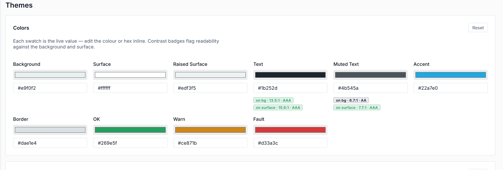

# Theming

Colour, type, spacing and radii are defined once as **tokens** and every widget reads them. Restyle the whole project — or match a customer's brand — without touching a single page.

## How theming works

Widgets never hardcode a colour or a font size; they reference theme tokens (the `--hmi-*` custom properties). Change a token in the **Themes** area and every widget that uses it updates at once. A widget property only *overrides* the theme when you deliberately set it — leave it unset and it tracks the token.

## Set up a theme

1. **Open the Themes area** — Pick **Themes** in the editor's left rail. Tokens are grouped — colours, typography, containers, and more.
2. **Set the core colours** — Define **bg**, **surface** and **text**, plus your **accent**. The editor shows live **contrast checks** (text on bg, text on surface) so you keep it legible.
3. **Choose typefaces** — Pick a UI font and a mono font. Several are bundled ready to use — **Inter**, **Manrope**, **Lexend**, and **Roboto Mono** / **JetBrains Mono**.
4. **Dial in shape & spacing** — Set the base **radius** and spacing tokens so cards, buttons and inputs share one consistent feel.

> [!TIP]
> Because the theme is just tokens on disk, you can keep per-customer themes in version control and swap them per deployment — same pages, different brand.
