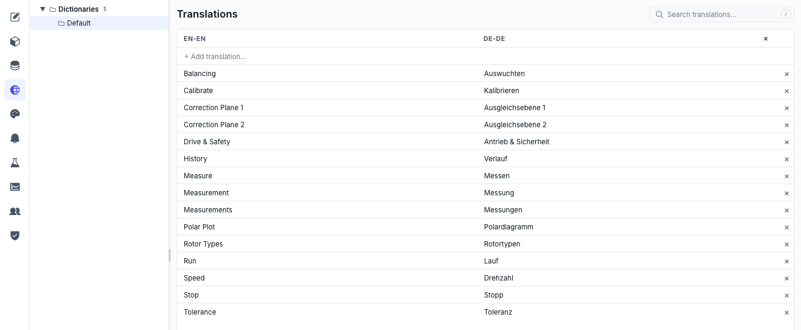

# Translations & languages

Any text on a screen can be a **`$loc`** value instead of a literal. The operator picks a language, every `$loc` field re-renders, and no page has to change. Same pages, same bindings, different words.

## How it works

- A **dictionary** is a table: one row per phrase, one column per language. It is stored as a plain CSV in `<project>/translations/<name>.csv`, so it is diffable and a translator can be sent the file.
- **The first language column is the primary**, and its text *is* the key. Write `Motor speed` in English, and every screen binds `$loc: "Motor speed"`; the Dutch column holds `Motorsnelheid`.
- **A missing translation falls back to the key** — the primary-language text. Nothing ever renders blank or shows a raw `MSG_0421`-style token, which is the main reason the key is real text and not an id.
- The chosen language is **remembered per browser**, so a panel stays in the operator's language across restarts.



## Set the languages up

1. **Open the Translations area** — Pick **Translations** in the editor's left rail.
2. **Add a language column** — Add each language by code (`en-EN`, `nl-NL`, `de-DE`). The **primary column cannot be renamed, moved or removed** — every key in the project depends on it. Removing a secondary language drops just that column.
3. **Add a phrase** — Type the primary-language text; the row appears with empty cells for the other languages.
4. **Fill the cells** — Edit each translated cell inline. The primary cell is read-only by design: changing it would change the key and break every binding pointing at it.
5. **Save** — Translations save with the editor's normal **Save**.

> [!NOTE]
> **Keys are immutable.** To reword the English, add the new phrase, re-point the bindings, then delete the old row. That is deliberate — a silent key rename would leave every other language column attached to text that no longer means the same thing.

## Split the catalog into dictionaries

The tree on the left lists dictionaries. **Default** always exists and cannot be deleted; add others (`Motor`, `Alarms`, `Maintenance`) to keep a large project navigable. Each is its own CSV with its own language columns, edited independently.

## Use a translation on a screen

Set any `String` field's source to **Localizable Text (`$loc`)** and pick the phrase. It works anywhere a string does — a label, a button caption, a page title, an alarm message, a toast.

```
"label": { "$loc": "Motor speed" }
```

Need translated text with live values beside it? Combine the two: **`$stringExpr`** builds a string from a template with `{1}`, `{2}` placeholders, and each placeholder is its own binding — so a placeholder can be a `$loc` while the next one is a tag. The template itself is literal, so keep the translatable words in the wildcards and only structure in the template. See [Dynamic properties](properties.md#build-a-string-from-parts-stringexpr).

## Let operators switch language

Three ways, pick whichever suits the panel:

- **Language Switcher widget** — drop it in a shell region and it lists the configured languages with a label of your choosing. See the [catalog](catalog.md#language-switcher).
- **Set language action** — a **Set language** action on any button, with the code either fixed (a flag button per language) or bound. See [Actions](actions.md#interface).
- **`$languages` source** — the list of configured language codes as a `String[]`, for building your own picker in a custom widget.

Whichever you use, the change is instant and project-wide within that runtime — no reload, no navigation.

Language changes also fire the **`onLocaleChanged`** global event, which is where "re-fetch the shift report in the new language" belongs. See [Global events](actions.md#global-events).

## Working with translators

The CSV is the hand-off. Send `translations/Default.csv`, get it back with a filled column, drop it in place. Two rules keep that safe:

- Do not reorder or rename the header row — the first code is the primary and the rest are matched by name.
- Do not edit the first column. It is the key; changing it orphans every binding.

If two people save the same dictionary at once, the second save is refused with a conflict rather than silently overwriting: reload, then re-apply.
