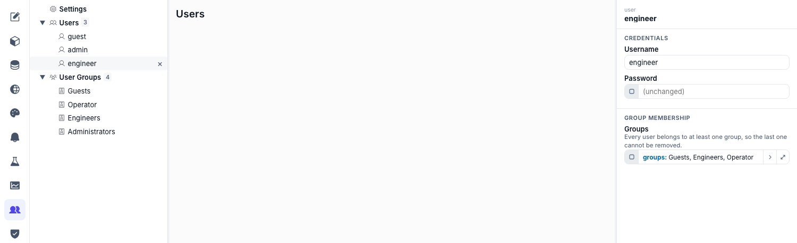

# Users, groups & permissions

Who is at the panel decides what they see and what they may change. NEXT HMI answers that with **groups** — a user belongs to one or more, and everything else (a hidden button, a read-only setpoint, access to the editor itself) is a group test. There is no scripting anywhere in this.

## The model in four sentences

- A **group** is a label with an id — `guest`, `operator`, `engineer`, `admin` ship by default. Add your own freely.
- A **user** is a username, a password, and at least one group.
- **`guest`** is the built-in anonymous identity: it always exists, always belongs only to the `guest` group, and can never be given a password. It is who you are before signing in.
- **Every screen decides for itself** what a given group may see or touch, using the `$userGroups` source on the widget's **Visible** and **Interactable** fields.

All of it lives in `users.json` inside the project folder, with passwords stored hashed — never in plain text, and never sent back to the browser.

## Add users and groups

1. **Open the Users area** — Pick **Users** in the editor's left rail. The tree lists **Settings**, then your groups, then your users.
2. **Add a group** — Give it a **Label**; the **id** is fixed at creation and is what bindings refer to. Keep ids short and stable (`maintenance`, `shift-lead`) — renaming the label is free, the id is not.
3. **Add a user** — Set the **Username**, a **Password**, and tick the **Groups** they belong to. A user must keep at least one group, so the last one cannot be removed.
4. **Save users** — Accounts save on their own **Save users** button in the header, separate from the normal Save, so a security change is never carried along by an unrelated page edit. **Discard users** throws the draft away.

> [!NOTE]
> **The password field never shows you the current password.** It reads *(unchanged)* once one is set — the server only stores a hash. Type a new one to replace it; leave it alone and the existing one is kept.

## Settings: auto-login and editor access

Select **Settings** in the tree for the two project-wide choices:

| Setting | Means |
|---|---|
| **Auto-login user** | Who a freshly opened runtime is signed in as before anyone touches it. `guest` is the normal answer; picking a real user makes an unattended panel start out with that user's rights. |
| **Config access — allowed groups** | Which groups may open the **editor** at all. Defaults to `engineer` and `admin`. Set it to nobody and the editor is closed to everyone. |

> [!IMPORTANT]
> Config access is the fence around the project itself — anyone inside it can rewrite pages, alarms and users. Keep it to the groups that genuinely engineer the system, and give those users real passwords.

## Sign in and out on a screen

There is no built-in login widget, because a sign-in screen is layout like any other. Wire one with actions ([Actions](actions.md)):

- **Log in** — a **Log in user** action whose **Username** and **Password** are bound to wherever the operator typed them (a custom-widget field exported as a `$widgetProp`, a component input, a `$static` for a fixed kiosk account). It runs asynchronously: use `onFailed` to show a toast on a wrong password, `onSuccess` to navigate to the home page.
- **Log out** — a **Log out user** action drops the session back to the auto-login user.

Sign-in is **per open runtime**, not per browser and not per installation: two tabs on the same panel PC can be two different operators, and each keeps its own identity until it is closed or logged out.

Global events give the rest of the plumbing — `onUserLoggedIn` and `onUserLoggedOut` fire project-wide, which is where "go to the home page on login, back to the lock screen on logout" belongs. See [Global events](actions.md#global-events).

## Gate what a group can see and do

Every widget carries **Visible** and **Interactable** in its **Visibility** group. Both are plain booleans, so any source can drive them — but the one you want here is **`$userGroups`**, which is true when the signed-in user is in one of the groups you tick (an empty list means *everyone*).

| Goal | Set |
|---|---|
| Hide a maintenance panel from operators | **Visible** → `$userGroups` → `engineer`, `admin` |
| Show a Start button to everyone but let only operators press it | **Interactable** → `$userGroups` → `operator` |
| Show different text per role | any `String` field → `$if` with a `$userGroups` condition |

### What a locked widget does

A widget that is not **Interactable** renders read-only rather than disappearing — the operator can see the setpoint and see that it is not theirs to change. It is dimmed, and pressing it does nothing.

Whether the press *says* anything is a project-wide choice: the editor's **Settings** panel (see [Layout & the shell](layout.md)) carries **Locked feedback** with three modes.

| Mode | On press |
|---|---|
| **Marker at pointer** (default) | A ⊘ marker flashes where the finger or cursor landed. |
| **Notification** | A warning toast reads *Interaction not permitted*, dismissible and self-clearing. Hammering the same widget re-uses the toast already on screen. |
| **None** | Nothing — the press is swallowed silently, and the widget carries no tooltip either. |

Pick **Notification** for a panel where a small flash is easy to miss, **None** where a locked control should read as plain decoration.

Two more sources read the identity directly, for labels and lists rather than gates: **`$user`** gives the signed-in **username** or their **groups** (and `userList`, every username in the project — the raw material for a user-picker screen).

## Enforcement, and where it really happens

Hiding a button is presentation. The write itself is checked on the server: a datasource variable may carry an **`interactableByGroups`** list, and a write to it from a session outside those groups is refused with `permission_denied` — over the WebSocket and over REST alike. There is no editor field for it yet; set it on the variable entry in the datasource file (or via the datasource API) when a tag must be protected against more than a hidden button.

> [!IMPORTANT]
> Treat `Visible` / `Interactable` as ergonomics, not as security. They keep the wrong control out of the wrong hands on the panel; they do not stop someone who reaches the API. For tags that matter, set `interactableByGroups` on the variable as well, and keep the runtime off untrusted networks — see [HTTPS](install.md#https).

## How this relates to the other two passwords

Three separate credentials exist, and mixing them up is the usual confusion:

| Credential | Gates | Lives in |
|---|---|---|
| **Device-admin password** | The **Manager** dashboard — starting, stopping, importing, transferring projects. | The installation, not any project. |
| **Operator password** (this project's `admin` user) | Signing in to *this project's* runtime and editor. Set once, on first start of a project copied from the seed. | `users.json` in the project. |
| **Any other user's password** | Whatever that user's groups allow. | `users.json` in the project. |

A project copied from the seed ships **no reusable credential** — the manager asks you to **Set operator password** before it will start, and that creates this project's `admin` user. See [Managing projects](projects.md#the-manager-dashboard).

## If `users.json` goes bad

On startup an unreadable or structurally invalid `users.json` is backed up next to itself as `users.json.bak.invalid.<timestamp>` and replaced with the defaults — guest-only, `engineer` + `admin` for config access. You lose the accounts, not the project, and the original file is still there to read.
