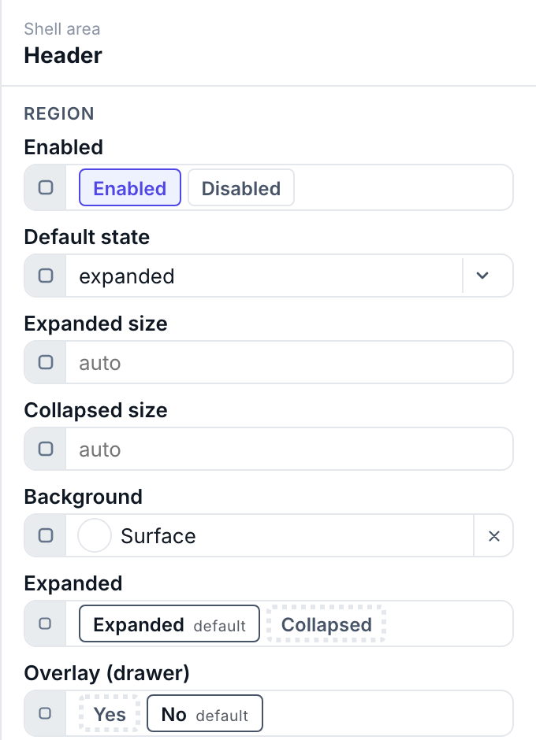

# Adding & arranging widgets

Widgets are the pieces you drop on a page. This chapter covers placing them, moving and nesting them in the tree, and configuring them through the schema-driven properties panel.

## Place a widget

1. **Open the picker** — Right-click a page or a container in the widget tree (or click the `+` on the row) and choose **Add Widget/Component…**. A searchable drawer opens with one card per type — icon, name and description — grouped by category, each badged **Built-in**, **Custom** or **Component**.
2. **Pick a type** — Search by name or scan the categories, then click the card — say **Button** or **Icon**. It's inserted into the tree at the point you clicked and selected for you.
3. **Position it in the tree** — Use **Move up** / **Move down** or drag the row to set stacking order, and drop it inside a **Container** to nest it. A placed **Component** that declares slots hosts widgets the same way — one group per slot in the tree ([slots →](properties.md#passing-widgets-into-a-component-slots)).
4. **Configure it on the right** — The properties panel now lists exactly the fields this widget declares. Fill them in — many can be bound to live data instead of typed literally.

> [!TIP]
> **Don't know the name?** The picker searches names, types and descriptions, so typing part of what you're after is enough — the drawer is the only way to pick a type, so there are no sub-menus to scan.

> [!TIP]
> **Containers are added their own way.** A `Container` has its own **Add Container** menu item rather than living in the widget list, because it's the thing that *hosts* other widgets. Drop widgets into it to build layout — see [Layout](layout.md).

## Schema-driven properties

Every widget declares a **schema** — the list of fields it exposes and the type of each. The panel renders the correct editor per field, so you never type a color into a text box:

- a `color` field opens a color picker (with theme-token support),
- an `icon` field opens the icon picker, an `image` field the asset picker,
- a `select` shows a dropdown of allowed values,
- a `struct` field (like a Button's bound variable) exposes its members to bind individually.

Most fields also carry a small **source pill** — that's where a static value becomes a live binding. Full detail in [Dynamic properties](properties.md).

## Make controls do something: actions

Interactive widgets (**Button**, **Menu Toggle**) have an **Actions** field holding a list that runs, top to bottom, when the control is pressed. The thirteen action types cover four jobs:

- **Screens** — open or close a **dialog**, or open an ordinary page as a **page overlay**.
- **Machine** — **write a variable** (set a coil, a mode, a setpoint), or **load / save a recipe**.
- **Session** — **log a user in or out**.
- **Interface** — switch **language** or **theme**, raise a **toast**, or put a confirm **alert** in front of a dangerous write.

The five that cross the wire carry `onSuccess` / `onFailed` / `onSettled` handler lists, whose actions can read the outcome with `$result`. Full catalog, fields and worked examples: [Actions & events](actions.md).

> [!NOTE]
> **Moving between pages is not an action.** Navigation widgets read the page tree instead — see [Pages & navigation](pages.md#give-operators-a-way-around).

> [!NOTE]
> **Visibility & permissions.** Every widget exposes **Visible** and **Interactable** booleans. Set either one's source to `$userGroups` and it becomes a group test — a Start button restricted to *operator* renders read-only for everyone else, with no scripting. See [Users, groups & permissions](users.md#gate-what-a-group-can-see-and-do).
